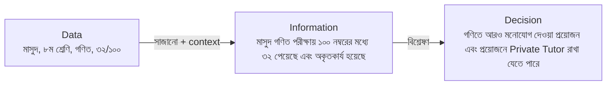

PostgreSQL শেখার আগে কিছু টার্মিনোলজি সম্পর্কে ধারণা থাকা দরকার। এই লেসনে আমরা কিছু বেসিক টার্মিনোলজি নিয়ে আলোচনা করব ইনশাআল্লাহ।

## What is Data?

**Data**-কে বাংলায় বলা হয় উপাত্ত। ডাটা বা উপাত্ত হলো কিছু বিচ্ছিন্ন সংখ্যা, শব্দ বা মান, যা এককভাবে কোনো অর্থ প্রকাশ করে না। যেমন:

<Reveal each>

- `মাসুদ` — এটা data। কিন্তু মাসুদ কে বা কী করেছে? কোনো অর্থ বহন করে? না।
- `৮` — এটা data। কিন্তু কীসের ৮? কোনো অর্থ বহন করে? না।
- `গণিত` — এটাও data। কিন্তু গণিত দিয়ে কী বোঝানো হচ্ছে? কোনো অর্থ বহন করে? না।
- `৩২` — এটাও data। কিন্তু কীসের ৩২? কোনো অর্থ বহন করে? না।

</Reveal>

### ডাটার ধরন

সব ডাটা কিন্তু একরকম দেখতে না। ফরম্যাট অনুযায়ী ডাটাকে মোটামুটি তিন ভাগে ভাগ করা যায়:

| ধরন | বৈশিষ্ট্য | উদাহরণ |
| --- | --- | --- |
| **Structured** | নির্দিষ্ট ফরম্যাট আছে, row আর column আকারে সাজানো যায় | রেজাল্ট শিট, ব্যাংক স্টেটমেন্ট, প্রোডাক্টের লিস্ট |
| **Semi-structured** | কিছুটা স্ট্রাকচার আছে, কিন্তু সব রেকর্ডে একই ফিল্ড নাও থাকতে পারে | JSON, XML, API response |
| **Unstructured** | কোনো নির্দিষ্ট ফরম্যাট নেই | ছবি, ভিডিও, অডিও, PDF, ইমেইলের লেখা |

<Callout type="info" title="এই সিরিজে কোনটা?">
PostgreSQL-এর মতো রিলেশনাল ডাটাবেস মূলত **structured data**-র জন্য। তবে PostgreSQL-এর `JSONB` টাইপ দিয়ে semi-structured ডাটাও রাখা যায় — সেটা পরে দেখব ইনশাআল্লাহ।
</Callout>

## Data → Information → Decision

Information-কে বাংলায় বলা হয় তথ্য। Data-কে যখন context দিয়ে সাজানো হয় বা প্রসেস করে অর্থবোধক করা হয়, তখন তাকে **information** বা **তথ্য** বলা হয়।

<Reveal>

> **মাসুদ** ৮ম শ্রেণির একজন ছাত্র। সে গণিত পরীক্ষায় ১০০ নম্বরের মধ্যে ৩২ পেয়েছে এবং পরীক্ষায় অকৃতকার্য হয়েছে।

একই data, কিন্তু এখন এটা অর্থবোধক হওয়ায় এর উপর ভিত্তি করে তার অভিভাবক **সিদ্ধান্ত (decision)** নিতে পারেন যে, মাসুদের গণিতে আরও মনোযোগ দেওয়া প্রয়োজন এবং প্রয়োজনে তার জন্য একজন Private Tutor রাখা যেতে পারে।

</Reveal>

### সফটওয়্যারের দুনিয়ায় একই ব্যাপার

এই পুরো সিরিজে আমরা একটা **অনলাইন শপ** (e-commerce) নিয়ে কাজ করব — যেখানে কাস্টমাররা ইলেকট্রনিক্স, কাপড়, বই, এরকম নানা ক্যাটাগরির প্রোডাক্ট অর্ডার করে। চলুন সেখানেও data → information → decision-এর ফ্লোটা দেখি:

<Steps reveal>
<Step>
### Data
`Wireless Mouse`, `850`, `3`, `2026-09-15` — আলাদা আলাদা কিছু মান। এককভাবে কোনো অর্থ নেই।
</Step>
<Step>
### Information
"গত সপ্তাহে **Wireless Mouse** বিক্রি হয়েছে ১২০টা, অথচ স্টকে আছে মাত্র ৩টা।"
</Step>
<Step>
### Decision
শপের মালিক সিদ্ধান্ত নিলেন, আজকেই সাপ্লায়ারকে নতুন ২০০টা মাউসের অর্ডার দিতে হবে।
</Step>
</Steps>

<small>(সংখ্যাগুলো বানানো উদাহরণ।)</small>

খেয়াল করুন, "১২০টা বিক্রি হয়েছে" — এই information বের করতে হলে প্রতিটা অর্ডারের ডাটা কোথাও না কোথাও **সংরক্ষণ করে রাখা** লাগবে। এখান থেকেই আসে ডাটাবেসের প্রয়োজন।

## What is a Database?

ডাটাকে সাজিয়ে গুছিয়ে (organize করে) কোনো একটা জায়গায় রাখলে, সাধারণভাবে সেটাকে আমরা ডাটাবেস বলতে পারি। এই জায়গাটা হতে পারে একটা নোটবুক, একটা Excel ফাইল, বা অন্য যেকোনো কিছু।
কিন্তু আমাদের কনটেক্সটে, ডাটাবেস মানে হলো কম্পিউটারের স্টোরেজে রাখা ডাটার এমন একটা কালেকশন, যেটা একটা স্পেশাল সফটওয়্যার দিয়ে ম্যানেজ করা হয়।

আমরা প্রতিদিনই ডাটাবেস ইউজ করি, হয়তো খেয়াল না করেই:

<Reveal each>

- **Phone-এর contact list** — নাম, নম্বর, ইমেইল সাজানো আছে; নাম লিখলেই খুঁজে পান।
- **bKash / Nagad-এর transaction history** — প্রতিটি লেনদেনের তারিখ, পরিমাণ, কাকে পাঠালেন।
- **Library register** — কোন বই কে কবে নিয়েছে, কবে ফেরত দেবে।
- **Facebook** — user, post, comment, like — সবই ডাটাবেসে।
- **দোকানের বাকির খাতা** — কাগজে লেখা, কিন্তু এটাও এক ধরনের ডাটাবেস!

</Reveal>

## Why Do Applications Need Databases?

একটা অ্যাপ্লিকেশন চলার সময় ডাটা থাকে **RAM**-এ — যেমন কোডের ভেরিয়েবল। সমস্যা হলো:

<Reveal each>

- সার্ভার রিস্টার্ট হলে বা কারেন্ট চলে গেলে RAM-এর সব ডাটা হারিয়ে যায়।
- একটা কাস্টমার আজকে অর্ডার দিলে, কালকে লগইন করে সেই অর্ডার দেখতে চাইবে — মানে ডাটাকে **স্থায়ীভাবে (persist)** রাখতে হবে।
- একই সাথে হাজার কাস্টমার শপে ঢুকছে — সবাই যেন একই সঠিক ডাটা দেখে।

</Reveal>

তাহলে সমাধান কী? ডাটাকে ডিস্কে, মানে কোনো ফাইলে লিখে রাখা? চলুন দেখি ফাইল দিয়ে কাজ চালালে কী হয়।

### ডাটাবেস ছাড়া: খাতা আর Excel

আমাদের অনলাইন শপ যখন ছোট ছিল, তখন সব অর্ডারের হিসাব রাখা হতো একটা Excel শিটে:

| order_no | customer | phone        | product        | category    | price | date       |
| -------- | -------- | ------------ | -------------- | ----------- | ----- | ---------- |
| 1        | রহিম     | 01711-000001 | Wireless Mouse | Electronics | 850   | 2026-09-01 |
| 2        | করিম     | 01811-000002 | জামদানি শাড়ি  | Fashion     | 4500  | 2026-09-02 |
| 3        | রহিম     | 01711-000009 | Wireless Mouse | Electronic  | 800   | 2026-09-05 |

<small>(নাম, নম্বর ও দাম বানানো উদাহরণ।)</small>

দোকান ছোট থাকলে এটা চলে। কিন্তু ব্যবসা বড় হলে সমস্যা শুরু হয়:

<Reveal each>

- **একই ডাটা বারবার (Redundancy)** — রহিমের নাম-নম্বর, প্রোডাক্টের ক্যাটাগরি প্রতিটি অর্ডারে আবার লিখতে হচ্ছে।
- **পরস্পরবিরোধী ডাটা (Inconsistency)** — row 3-এ রহিমের নম্বর আলাদা, ক্যাটাগরির বানান ভুল (`Electronic`), দামও আলাদা। কোনটা সঠিক?
- **একসাথে কাজ (Concurrency)** — দুজন স্টাফ একই ফাইল একসাথে এডিট করলে একজনের কাজ আরেকজনের কাজ মুছে দিতে পারে। আর শেষ মাউসটা দুজন কাস্টমার একসাথে কিনে ফেললে?
- **সিকিউরিটি (Security)** — ফাইল যার কাছে আছে সে সব দেখতে ও বদলাতে পারে; "শুধু অর্ডার দেখতে পারবে, দাম বদলাতে পারবে না" — এমন নিয়ম করা কঠিন।
- **ভুল ডাটা আটকানো যায় না (Integrity)** — দামের ঘরে কেউ `"আটশো"` লিখলে বা খালি রাখলে কেউ বাধা দেবে না।
- **ডাটা হারানো (Recovery)** — কম্পিউটার ক্র্যাশ করলে বা ফাইল নষ্ট হলে সব শেষ।
- **খোঁজা কঠিন (Querying)** — "গত মাসে কোন ক্যাটাগরির প্রোডাক্ট সবচেয়ে বেশি বিক্রি হয়েছে?" — লাখ row-এ এটা বের করা ধীর আর ঝামেলার।

</Reveal>

<Callout type="idea" title="তাহলে সমাধান?">
এই সব সমস্যা সমাধান করার জন্যই আছে একটা স্পেশাল সফটওয়্যার — **DBMS**। পরের লেসনে সেটাই দেখব।
</Callout>

## সারসংক্ষেপ

<Steps reveal>
<Step>
### Data → Information → Decision
কাঁচা data (উপাত্ত) context পেলে information (তথ্য) হয়, আর information থেকে আমরা decision নিই।
</Step>
<Step>
### Database
কম্পিউটারের স্টোরেজে রাখা সাজানো ডাটার কালেকশন, যেটা স্পেশাল সফটওয়্যার দিয়ে ম্যানেজ করা হয়।
</Step>
<Step>
### অ্যাপ্লিকেশনের ডাটাবেস লাগে কারণ
ডাটা স্থায়ীভাবে রাখতে হয়, অনেক ইউজার একসাথে ইউজ করে, আর সাধারণ ফাইলে redundancy, inconsistency, concurrency, security, integrity, recovery আর querying-এর সমস্যা হয়।
</Step>
</Steps>
