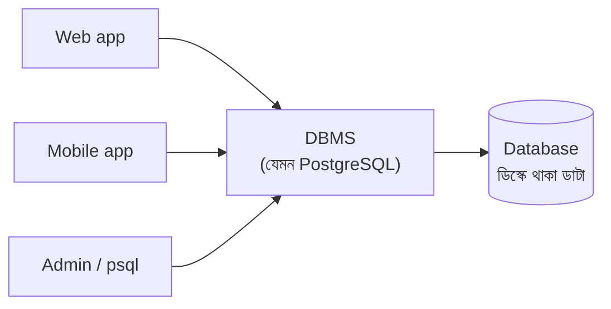
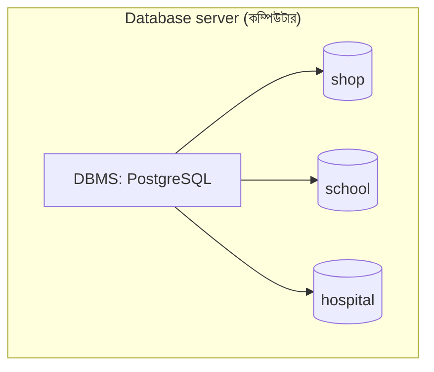

## What is a DBMS?

ডাটাবেসের কাজ হলো ডাটাকে সাজিয়ে গুছিয়ে স্টোর করে রাখা। আর এই ডাটাবেস ম্যানেজ করার জন্য যে সফটওয়্যার ইউজ করা হয়, তাকে আমরা **Database Management System** বা **DBMS** বলি। যেমন PostgreSQL, MySQL।

ডাটাবেস ম্যানেজ বলতে বোঝায়: নতুন ডাটাবেস ক্রিয়েট করা, ডাটা অ্যাড করা, ডাটা খুঁজে বের করা, ডাটা আপডেট করা, ডাটা ডিলিট করা, আর ডাটাবেসকে সিকিউর রাখা।

### উদাহরণ: আমাদের অনলাইন শপ

চলুন একটা উদাহরণ দিয়ে জিনিসটা আরেকটু ভালোভাবে বুঝি।

আমাদের অনলাইন শপে কাস্টমাররা অনলাইনে প্রোডাক্ট অর্ডার করে। এই শপের একটা ডাটাবেস আছে। আমরা জানি, ডাটাবেসে ডাটা সাজিয়ে গুছিয়ে রাখা থাকে। এই সাজানোটা অনেকভাবে হতে পারে, তবে সবচেয়ে কমন ফরম্যাট হলো **টেবিল**। মানে ডাটাগুলো row আর column আকারে সাজানো থাকে।

একটা অনলাইন শপে অনেক ধরনের ডাটা থাকতে পারে। আপাতত আমরা দুটো ধরি: কাস্টমারদের ডাটা আর প্রোডাক্টের ডাটা।

**`customers`**

| id  | name    | phone        | city      |
| --- | ------- | ------------ | --------- |
| 1   | রহিম    | 01711-000001 | ঢাকা      |
| 2   | করিম    | 01811-000002 | চট্টগ্রাম |
| 3   | সাদিয়া | 01911-000003 | সিলেট     |

**`products`**

| id  | name           | category    | price | stock |
| --- | -------------- | ----------- | ----- | ----- |
| 1   | Wireless Mouse | Electronics | 850   | 40    |
| 2   | জামদানি শাড়ি  | Fashion     | 4500  | 6     |
| 3   | পথের পাঁচালী   | Books       | 450   | 25    |
| 4   | USB-C Charger  | Electronics | 1200  | 15    |

<small>(নাম, নম্বর, দাম ও স্টক বানানো উদাহরণ।)</small>

এটাই আমাদের ডাটাবেস, যেখানে ডাটাগুলো টেবিল আকারে সাজানো আছে। টেবিল আকারে সাজানোর মেইন উদ্দেশ্য হলো, যেন একটা DBMS দিয়ে এই ডাটা সহজে ম্যানেজ করা যায়।

এখন দেখি বাস্তবে এই ডাটাবেসে কী কী কাজ করতে হয়:

<Reveal each>

- **নতুন ডাটা অ্যাড করা** — শপে নতুন একটা প্রোডাক্ট এলো। এটাকে `products` টেবিলে অ্যাড করতে হবে। একইভাবে নতুন কেউ সাইটে অ্যাকাউন্ট খুললে তাকে `customers` টেবিলে অ্যাড করতে হবে।
- **ডাটা খুঁজে বের করা** — একজন কাস্টমার সাইটে সার্চ করল, "১০০০ টাকার নিচে কী কী Electronics আছে?" তখন ডাটাবেস থেকে মিলে যাওয়া প্রোডাক্টগুলো খুঁজে বের করে দেখাতে হবে। আবার শপের মালিক জানতে চাইতে পারেন, কোন প্রোডাক্টের স্টক কম।
- **ডাটা আপডেট করা** — ঈদ উপলক্ষে USB-C Charger-এর দাম ১২০০ থেকে কমিয়ে ১০০০ করা হলো। তখন `price` column-এর ভ্যালু আপডেট করতে হবে। আবার কেউ Wireless Mouse কিনলে তার `stock` এক কমাতে হবে।
- **ডাটা ডিলিট করা** — কোনো প্রোডাক্ট শপ আর বিক্রি করবে না, তখন সেটাকে ডিলিট করার দরকার হতে পারে।

</Reveal>

<Reveal>

**নতুন টেবিল ক্রিয়েট করা** — ধরুন শপে নতুন একটা ফিচার চালু হলো, যেটা আগে ছিল না: কাস্টমাররা প্রোডাক্টে রিভিউ দিতে পারবে। কোন কাস্টমার কোন প্রোডাক্টে কত রেটিং দিল, এই ডাটা রাখার জন্য নতুন একটা টেবিল ক্রিয়েট করতে হবে।

**`reviews`**

| id  | customer_id | product_id | rating | comment                  |
| --- | ----------- | ---------- | ------ | ------------------------ |
| 1   | 1           | 1          | 5      | মাউসটা খুবই স্মুথ        |
| 2   | 3           | 2          | 4      | সুন্দর, তবে ডেলিভারি দেরি |

</Reveal>

<Reveal>

**ডাটা সিকিউর রাখা** — কাস্টমারের ফোন নম্বর আর ঠিকানার মতো ডাটা শপের অ্যাডমিন ছাড়া বাইরের কেউ যেন দেখতে না পারে। একজন কাস্টমার যেন অন্য কারো ডাটা দেখতে না পারে। আর কেউ যেন ভুল করে বা ইচ্ছা করে প্রোডাক্ট বা অর্ডারের ডাটা ডিলিট করে দিতে না পারে।

</Reveal>

এই যে এতগুলো কাজ, এগুলো আমাদেরকে করতে দেয়, মানে **অ্যালাউ করে**, একটা **DBMS**।

**DBMS-এর কাজ, এক নজরে:**

<Reveal each>

- নতুন ডাটাবেস আর টেবিল ক্রিয়েট করা
- ডাটা অ্যাড করা (**C**reate)
- ডাটা খুঁজে বের করা (**R**ead)
- ডাটা আপডেট করা (**U**pdate)
- ডাটা ডিলিট করা (**D**elete)
- ডাটাতে ইজি অ্যাক্সেস দেওয়া
- ডাটা সিকিউর রাখা — কে দেখতে পারবে, কে চেঞ্জ করতে পারবে, তা কন্ট্রোল করা

</Reveal>

### DBMS কীভাবে Excel-এর সমস্যাগুলো সমাধান করে

DBMS-এর সাথে কাজ করার সময় আপনি সরাসরি ফাইলে হাত দেন না — DBMS-কে বলেন কী চান, আর DBMS সেটা নিরাপদে করে দেয়।

[আগের লেসনে](/docs/postgresql/data-and-database#ডাটাবেস-ছাড়া-খাতা-আর-excel) Excel শিটের যে সমস্যাগুলো দেখেছিলাম, DBMS সেগুলোর সমাধান দেয় এভাবে:

| Excel/খাতার সমস্যা | DBMS-এর সমাধান |
| --- | --- |
| একই ডাটা বারবার | ডাটা আলাদা টেবিলে ভাগ করে একবারই রাখা যায় (কাস্টমার একবার, অর্ডারে শুধু তার ID) |
| পরস্পরবিরোধী ডাটা | ডাটা একবার থাকায় এক জায়গায় বদলালেই সব জায়গায় ঠিক |
| একসাথে কাজ | হাজার ইউজার একসাথে পড়তে-লিখতে পারে, DBMS সংঘর্ষ সামলায় (**concurrency control**) |
| সিকিউরিটি | User আর role অনুযায়ী permission — কে কী দেখতে/বদলাতে পারবে |
| ভুল ডাটা | **Constraint** — দাম অবশ্যই সংখ্যা, খালি রাখা যাবে না, ইত্যাদি |
| ডাটা হারানো | Backup, crash recovery, **transaction** |
| খোঁজা কঠিন | **Query language** (SQL) আর **index** দিয়ে দ্রুত খোঁজা |

<Callout type="idea" title="সামনের লেসনে">
Constraint শিখব **Table ও data type** লেসনে, index **Index** লেসনে, আর transaction ও crash recovery **Transaction ও ACID** লেসনে।
</Callout>

### জনপ্রিয় কিছু DBMS

| DBMS | ধরন | কোথায় বেশি দেখা যায় |
| --- | --- | --- |
| **PostgreSQL** | Relational | Web app, SaaS, analytics — এই সিরিজের বিষয় |
| **MySQL / MariaDB** | Relational | Web app, WordPress |
| **SQLite** | Relational (file-based) | Mobile app, desktop app, ছোট প্রজেক্ট |
| **Oracle, SQL Server** | Relational | বড় enterprise, ব্যাংক |
| **MongoDB** | Document (NoSQL) | ফ্লেক্সিবল স্ট্রাকচারের ডাটা |
| **Redis** | Key-value (NoSQL) | Cache, session, queue |

## Database vs DBMS

এই দুটো শব্দ প্রায়ই গুলিয়ে ফেলা হয় — অনেকে "PostgreSQL একটা ডাটাবেস" বলে। কথাটা পুরোপুরি ঠিক না। PostgreSQL হলো **DBMS**, আর তার ভেতরে আমরা যে `shop` বানাব, সেটা হলো **ডাটাবেস**।

<Reveal each>

- **Database** — ডাটা নিজেই, সাজানো অবস্থায় (যেমন আমাদের `shop` ডাটাবেস)।
- **DBMS** — যে সফটওয়্যার সেই ডাটা ম্যানেজ করে (যেমন PostgreSQL)।
- **Database server** — যে কম্পিউটার বা প্রসেসে DBMS চলছে। একটা সার্ভারে একাধিক ডাটাবেস থাকতে পারে।

</Reveal>

| | Database | DBMS |
| --- | --- | --- |
| কী জিনিস | ডাটার কালেকশন | সফটওয়্যার |
| কাজ | ডাটা ধরে রাখা | ডাটা ক্রিয়েট, রিড, আপডেট, ডিলিট, সিকিউর করা |
| উদাহরণ | `shop`, `school`, `hospital` | PostgreSQL, MySQL, MongoDB |
| সংখ্যা | একটা DBMS-এ অনেকগুলো ডাটাবেস থাকতে পারে | একটা সার্ভারে সাধারণত একটা DBMS চলে |

সহজ উপমা: **Database** হলো লাইব্রেরির বইগুলো, **DBMS** হলো লাইব্রেরিয়ান যিনি বই সাজান, খুঁজে দেন আর নিয়ম মানান, আর **server** হলো লাইব্রেরি ভবনটি।

## সারসংক্ষেপ

<Steps reveal>
<Step>
### DBMS
ডাটাবেস ম্যানেজ করার সফটওয়্যার — ডাটা অ্যাড, খোঁজা, আপডেট, ডিলিট আর সিকিউর রাখার কাজ করে।
</Step>
<Step>
### Excel-এর সমস্যার সমাধান
Redundancy, concurrency, security, integrity, recovery আর querying — সবকিছুর জন্য DBMS-এর নিজস্ব ব্যবস্থা আছে।
</Step>
<Step>
### Database ≠ DBMS
ডাটাবেস হলো ডাটা (`shop`), DBMS হলো সফটওয়্যার (PostgreSQL)।
</Step>
</Steps>
