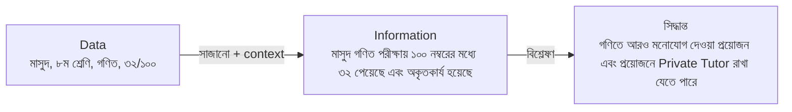
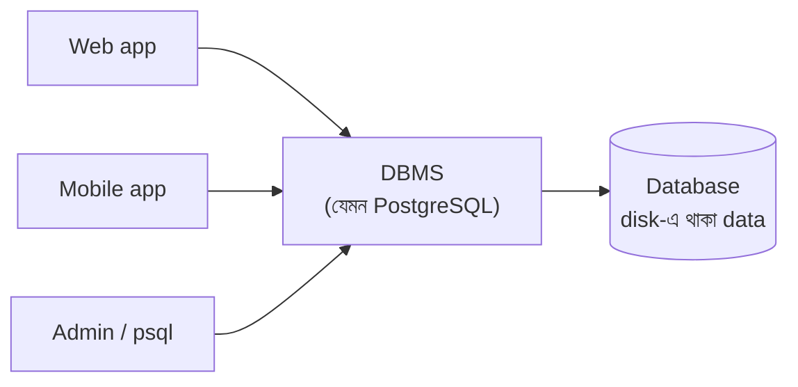
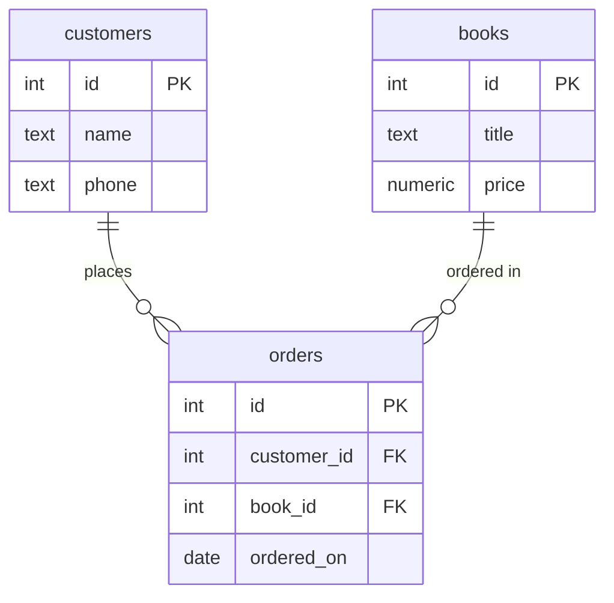

PostgreSQL শেখার আগে কিছু টার্মিনোলজি সম্পর্কে ধারণা থাকা দরকার। এই লেসনে আমরা কিছু বেসিক টার্মিনোলজি নিয়ে আলোচনা করব ইনশাআল্লাহ।

## Data কী?

**Data** কে বাংলায় বলা হয় উপাত্ত। ডাটা বা উপাত্ত হলো কিছু বিচ্ছিন্ন সংখ্যা, শব্দ বা মান যা এককভাবে কোন অর্থ প্রকাশ করে না । যেমনঃ-

<Reveal each>

- `মাসুদ` — এটা data। কিন্তু মাসুদ কে বা কি করেছে? কোনো অর্থ বহন করে? না।
- `৮` — এটা data। কিন্তু কীসের 8? কোনো অর্থ বহন করে? না।
- `"ইংরেজি"` — এটাও data। কিন্তু কীসের ইংরেজি? কোনো অর্থ বহন করে? না।
- `৩০` — এটাও data। কিন্তু কীসের ৩০? কোনো অর্থ বহন করে? না।

</Reveal>

<Reveal>

### Data থেকে Information

Information কে বাংলায় বলা হয় তথ্য। Data-কে যখন context দিয়ে সাজানো হয় বা প্রসেস করে অর্থবোধক করা হয় তখন তাকে **information** বা **তথ্য** বলা হয়।

> **মাসুদ** ৮ম শ্রেণির একজন ছাত্র। সে গণিত পরীক্ষায় ১০০ নম্বরের মধ্যে ৩২ পেয়েছে এবং পরীক্ষায় অকৃতকার্য হয়েছে।

একই data, কিন্তু এখন এটা অর্থবোধক হওয়ায় এর উপর ভিত্তি করে তার অভিভাবক সিদ্ধান্ত নিতে পারেন যে, মাসুদ-এর গণিতে আরও মনোযোগ দেওয়া প্রয়োজন এবং প্রয়োজনে তার জন্য একজন Private Tutor রাখা যেতে পারে।

</Reveal>



### Data-র ধরন

| ধরন                 | বৈশিষ্ট্য                                                         | উদাহরণ                                         |
| ------------------- | ----------------------------------------------------------------- | ---------------------------------------------- |
| **Structured**      | নির্দিষ্ট format, row-column-এ সাজানো যায়                        | বইয়ের তালিকা (নাম, দাম, লেখক), bank statement |
| **Semi-structured** | কিছুটা structure আছে, কিন্তু সব record-এ একই field নাও থাকতে পারে | JSON, XML, API response                        |
| **Unstructured**    | কোনো নির্দিষ্ট format নেই                                         | ছবি, video, audio, PDF, email-এর লেখা          |

<Callout type='info' title='এই সিরিজে কোনটা?'>
  Relational database (যেমন PostgreSQL) মূলত **structured data**-র জন্য। তবে
  Postgres-এর `JSONB` type দিয়ে semi-structured data-ও রাখা যায় — সেটা পরে
  দেখব।
</Callout>

## Database কী?

**Database** হলো সাজানো-গোছানো (organized) data-র একটি সংগ্রহ, যেখান থেকে সহজে data খোঁজা, যোগ করা, বদলানো আর মুছে ফেলা যায়।

আমরা প্রতিদিনই database ব্যবহার করি, হয়তো খেয়াল না করেই:

<Reveal each>

- **Phone-এর contact list** — নাম, নম্বর, email সাজানো আছে; নাম লিখলেই খুঁজে পান।
- **bKash / Nagad-এর transaction history** — প্রতিটি লেনদেনের তারিখ, পরিমাণ, কাকে পাঠালেন।
- **Library register** — কোন বই কে কবে নিয়েছে, কবে ফেরত দেবে।
- **Facebook** — user, post, comment, like — সবই database-এ।
- **দোকানের বাকির খাতা** — কাগজে লেখা, কিন্তু এটাও এক ধরনের database!

</Reveal>

## Database আসার আগে: খাতা আর Excel

ধরুন আমাদের ছোট একটি বইয়ের দোকান। শুরুতে সব হিসাব রাখা হচ্ছে একটি Excel sheet-এ:

| order_no | customer | phone        | book         | author           | price | date       |
| -------- | -------- | ------------ | ------------ | ---------------- | ----- | ---------- |
| 1        | রহিম     | 01711-000001 | পথের পাঁচালী | বিভূতিভূষণ       | 450   | 2026-09-01 |
| 2        | করিম     | 01811-000002 | Clean Code   | Robert C. Martin | 1200  | 2026-09-02 |
| 3        | রহিম     | 01711-000009 | পথের পাঁচালী | বিভূতিভূষন       | 400   | 2026-09-05 |

<small>(নাম, নম্বর ও দাম বানানো উদাহরণ।)</small>

দোকান ছোট থাকলে এটা চলে। কিন্তু ব্যবসা বড় হলে সমস্যা শুরু হয়:

<Reveal each>

- **একই data বারবার (Redundancy)** — রহিমের নাম-নম্বর, বইয়ের লেখকের নাম প্রতিটি order-এ আবার লিখতে হচ্ছে।
- **পরস্পরবিরোধী data (Inconsistency)** — row 3-এ রহিমের নম্বর আলাদা, লেখকের বানান ভুল (`বিভূতিভূষন`), দামও আলাদা। কোনটা সঠিক?
- **একসাথে কাজ (Concurrency)** — দুজন কর্মচারী একই file একসাথে edit করলে একজনের কাজ আরেকজনের কাজ মুছে দিতে পারে।
- **নিরাপত্তা (Security)** — file যার কাছে আছে সে সব দেখতে ও বদলাতে পারে; "শুধু বিক্রি দেখতে পারবে, দাম বদলাতে পারবে না" — এমন নিয়ম করা কঠিন।
- **ভুল data আটকানো যায় না (Integrity)** — দামের ঘরে কেউ `"চারশো"` লিখলে বা খালি রাখলে কেউ বাধা দেবে না।
- **Data হারানো (Recovery)** — computer crash করলে বা file নষ্ট হলে সব শেষ।
- **খোঁজা কঠিন (Querying)** — "গত মাসে কোন লেখকের বই সবচেয়ে বেশি বিক্রি হয়েছে?" — লাখ row-এ এটা বের করা ধীর আর ঝামেলার।

</Reveal>

এই সমস্যাগুলো সমাধান করতেই আসে **DBMS**।

## DBMS কী?

**DBMS (Database Management System)** হলো একটি software, যেটা database তৈরি, সংরক্ষণ আর পরিচালনা করে। আপনি সরাসরি file-এ হাত দেন না — DBMS-কে বলেন কী চান, আর DBMS সেটা নিরাপদে করে দেয়।



আগের প্রতিটি সমস্যার সমাধান DBMS কীভাবে দেয়:

| Excel/খাতার সমস্যা | DBMS-এর সমাধান                                                                    |
| ------------------ | --------------------------------------------------------------------------------- |
| একই data বারবার    | Data আলাদা table-এ ভাগ করে একবারই রাখা যায় (customer একবার, order-এ শুধু তার ID) |
| পরস্পরবিরোধী data  | Data একবার থাকায় এক জায়গায় বদলালেই সব জায়গায় ঠিক                             |
| একসাথে কাজ         | হাজার user একসাথে পড়তে-লিখতে পারে, DBMS সংঘর্ষ সামলায় (**concurrency control**) |
| নিরাপত্তা          | User আর role অনুযায়ী permission — কে কী দেখতে/বদলাতে পারবে                       |
| ভুল data           | **Constraint** — দাম অবশ্যই সংখ্যা, খালি রাখা যাবে না, ইত্যাদি                    |
| Data হারানো        | Backup, crash recovery, **transaction**                                           |
| খোঁজা কঠিন         | **Query language** (SQL) আর **index** দিয়ে দ্রুত খোঁজা                           |

<Callout type='idea' title='সামনের lesson-এ'>
  Constraint শিখব **Table ও data type** lesson-এ, index **Index** lesson-এ, আর
  transaction ও crash recovery **Transaction ও ACID** lesson-এ।
</Callout>

### জনপ্রিয় কিছু DBMS

| DBMS                   | ধরন                     | কোথায় বেশি দেখা যায়                       |
| ---------------------- | ----------------------- | ------------------------------------------- |
| **PostgreSQL**         | Relational              | Web app, SaaS, analytics — এই সিরিজের বিষয় |
| **MySQL / MariaDB**    | Relational              | Web app, WordPress                          |
| **SQLite**             | Relational (file-based) | Mobile app, desktop app, ছোট project        |
| **Oracle, SQL Server** | Relational              | বড় enterprise, bank                        |
| **MongoDB**            | Document (NoSQL)        | Flexible structure-এর data                  |
| **Redis**              | Key-value (NoSQL)       | Cache, session, queue                       |

## Database, DBMS আর Database server — পার্থক্য

এই তিনটি শব্দ প্রায়ই গুলিয়ে ফেলা হয়:

<Reveal each>

- **Database** — data নিজেই, সাজানো অবস্থায় (যেমন আমাদের `bookstore`)।
- **DBMS** — যে software সেই data পরিচালনা করে (যেমন PostgreSQL)।
- **Database server** — যে computer বা process-এ DBMS চলছে। একটি server-এ একাধিক database থাকতে পারে।

</Reveal>

সহজ উপমা: **Database** হলো লাইব্রেরির বইগুলো, **DBMS** হলো লাইব্রেরিয়ান যিনি বই সাজান, খুঁজে দেন আর নিয়ম মানান, আর **server** হলো লাইব্রেরি ভবনটি।

## DBMS-এর ধরন: Relational বনাম NoSQL

### Relational (RDBMS)

Data থাকে **table**-এ (row আর column), আর table-গুলো একে অপরের সাথে **relation** দিয়ে যুক্ত। Data-র structure (**schema**) আগে থেকে ঠিক করা থাকে। Query করা হয় **SQL** দিয়ে।

উদাহরণ: PostgreSQL, MySQL, SQLite, Oracle।

### NoSQL

"Not only SQL" — table ছাড়া অন্যভাবে data রাখে:

| ধরন             | কীভাবে রাখে                          | উদাহরণ    |
| --------------- | ------------------------------------ | --------- |
| **Document**    | JSON-এর মতো document                 | MongoDB   |
| **Key-value**   | একটি key → একটি value                | Redis     |
| **Graph**       | Node আর তাদের সম্পর্ক                | Neo4j     |
| **Wide-column** | বিশাল পরিমাণ data, অনেক server জুড়ে | Cassandra |

### কখন কোনটা?

| পরিস্থিতি                                                   | সাধারণ পছন্দ |
| ----------------------------------------------------------- | ------------ |
| Data-র মধ্যে পরিষ্কার সম্পর্ক আছে (customer → order → book) | Relational   |
| টাকা-পয়সা, stock — নির্ভুলতা সবচেয়ে জরুরি                 | Relational   |
| প্রতিটি record-এর structure আলাদা, ঘনঘন বদলায়              | Document     |
| খুব দ্রুত cache বা session                                  | Key-value    |
| Social network-এর মতো জটিল সম্পর্ক খোঁজা                    | Graph        |

<Callout type='info' title='আগে Relational শেখা কেন'>
  বেশিরভাগ application-এর মূল data (user, order, payment) relational ধরনের। তাই
  relational database শিখে শুরু করাই প্রচলিত পথ — আর PostgreSQL-এর `JSONB` দিয়ে
  document-ধরনের data-ও রাখা যায়।
</Callout>

## Relational model-এর মূল শব্দ

Excel-এর সেই এক বিশাল sheet ভেঙে আমরা আলাদা table বানাই — প্রতিটি table একটি বিষয় নিয়ে।

**`customers`**

| id  | name | phone        |
| --- | ---- | ------------ |
| 1   | রহিম | 01711-000001 |
| 2   | করিম | 01811-000002 |

**`books`**

| id  | title        | price |
| --- | ------------ | ----- |
| 1   | পথের পাঁচালী | 450   |
| 2   | Clean Code   | 1200  |

**`orders`**

| id  | customer_id | book_id | ordered_on |
| --- | ----------- | ------- | ---------- |
| 1   | 1           | 1       | 2026-09-01 |
| 2   | 2           | 2       | 2026-09-02 |
| 3   | 1           | 1       | 2026-09-05 |

<small>
  (বানানো উদাহরণ। আসল `bookstore` schema পরের lesson-গুলোতে ধাপে ধাপে বানাব।)
</small>

এখন রহিমের নাম-নম্বর মাত্র **একবার** আছে। Order-এ শুধু তার `id` (`customer_id = 1`)।

<Reveal each>

- **Table (relation)** — একটি বিষয়ের data, যেমন `customers`।
- **Row (record / tuple)** — একটি একক জিনিস, যেমন রহিম।
- **Column (field / attribute)** — একটি বৈশিষ্ট্য, যেমন `phone`।
- **Schema** — table-গুলোর structure: কোন table-এ কোন column, কোন type, কী নিয়ম।
- **Primary key** — প্রতিটি row-কে আলাদাভাবে চেনার column, যেমন `customers.id`। দুটি row-এর একই primary key হতে পারে না।
- **Foreign key** — অন্য table-এর primary key-কে নির্দেশ করে, যেমন `orders.customer_id` → `customers.id`। এভাবেই table-গুলো যুক্ত হয়।

</Reveal>



## SQL কী?

**SQL (Structured Query Language)** হলো relational database-এর সাথে কথা বলার ভাষা। আপনি বলেন **কী** চান, **কীভাবে** আনবে সেটা DBMS নিজে ঠিক করে।

```sql
-- রহিম কোন কোন বই কিনেছে?
SELECT books.title, orders.ordered_on
FROM orders
JOIN customers ON customers.id = orders.customer_id
JOIN books     ON books.id     = orders.book_id
WHERE customers.name = 'রহিম';
```

এখনই এটা বোঝার দরকার নেই — **CRUD query** lesson-এ বিস্তারিত দেখব। SQL command-গুলোকে কাজ অনুযায়ী কয়েক ভাগে ভাগ করা হয়:

| ভাগ     | পুরো নাম                     | কাজ                | উদাহরণ                                 |
| ------- | ---------------------------- | ------------------ | -------------------------------------- |
| **DDL** | Data Definition Language     | Structure তৈরি/বদল | `CREATE`, `ALTER`, `DROP`              |
| **DML** | Data Manipulation Language   | Data পড়া/লেখা     | `SELECT`, `INSERT`, `UPDATE`, `DELETE` |
| **DCL** | Data Control Language        | Permission         | `GRANT`, `REVOKE`                      |
| **TCL** | Transaction Control Language | Transaction        | `BEGIN`, `COMMIT`, `ROLLBACK`          |

## সারসংক্ষেপ

<Steps reveal>
  <Step>### Data → Information কাঁচা তথ্য context পেলে information হয়।</Step>
  <Step>### Database সাজানো data-র সংগ্রহ।</Step>
  <Step>
    ### DBMS Database পরিচালনার software — redundancy, concurrency, security,
    integrity আর recovery-র সমস্যা সমাধান করে।
  </Step>
  <Step>
    ### Relational database Data থাকে table-এ; primary key আর foreign key দিয়ে
    table যুক্ত; কথা বলি SQL দিয়ে।
  </Step>
  <Step>
    ### পরের lesson **PostgreSQL** — একটি relational DBMS। এবার সেটা নিজের
    computer-এ চালু করব।
  </Step>
</Steps>
