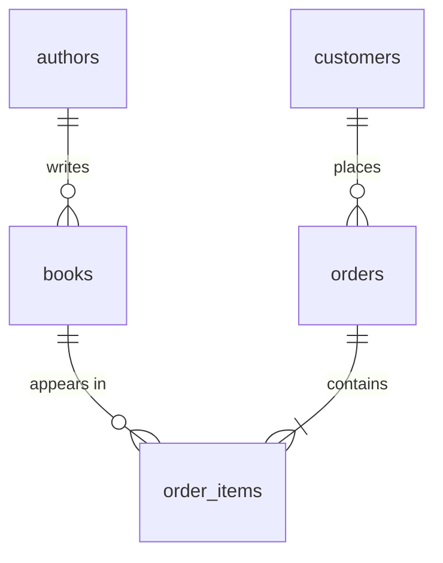

এই সিরিজে আমরা PostgreSQL একদম গোড়া থেকে শিখব — install করা থেকে শুরু করে table design, query লেখা, index দিয়ে query দ্রুত করা, আর transaction দিয়ে data নিরাপদ রাখা পর্যন্ত। প্রতিটি lesson একটি video-র সাথে মিলিয়ে লেখা, তাই video দেখার সময় পাশে খুলে রাখতে পারেন।

## কী কী শিখব

<Cards>
  <Card title="১. PostgreSQL পরিচিতি ও setup" href="/docs/postgresql/introduction">
    PostgreSQL কী, কেন ব্যবহার করব, আর নিজের computer-এ চালু করা।
  </Card>
  <Card title="২. Table ও data type" href="/docs/postgresql/tables-and-types">
    Table বানানো, সঠিক data type বাছাই আর constraint দিয়ে data ঠিক রাখা।
  </Card>
  <Card title="৩. CRUD query" href="/docs/postgresql/crud">
    Data যোগ করা, খোঁজা, পরিবর্তন আর মুছে ফেলা।
  </Card>
  <Card title="৪. Index" href="/docs/postgresql/indexes">
    Query কেন ধীর হয় আর index দিয়ে কীভাবে দ্রুত করা যায়।
  </Card>
  <Card title="৫. Transaction ও ACID" href="/docs/postgresql/transactions">
    একসাথে অনেক কাজ হলেও data কীভাবে নির্ভুল থাকে।
  </Card>
</Cards>

## শুরু করার আগে যা লাগবে

<Steps>
<Step>
### Terminal ব্যবহারের অভিজ্ঞতা
`cd`, `ls` এর মতো সাধারণ command চালাতে পারলেই যথেষ্ট।
</Step>
<Step>
### Docker (সুপারিশকৃত)
Docker থাকলে এক command-এ PostgreSQL চালু করা যায়। না থাকলে সরাসরি install করার পদ্ধতিও দেখানো আছে।
</Step>
<Step>
### একটি code editor
VS Code বা আপনার পছন্দের যেকোনো editor।
</Step>
</Steps>

## পুরো সিরিজে আমরা কী বানাব

পুরো সিরিজ জুড়ে আমরা একটি ছোট **online bookstore**-এর database বানাব। প্রতিটি lesson-এ এর সাথে নতুন কিছু যোগ হবে।

