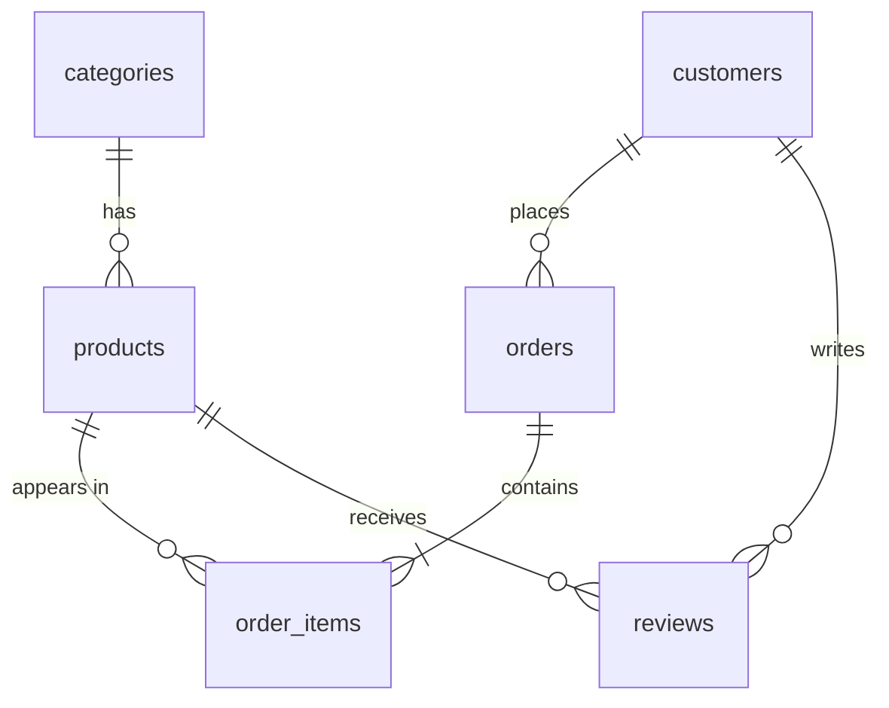

## Welcome to PostgreSQL for Developers

আসসালামু আলাইকুম! **PostgreSQL for Developers** সিরিজে আপনাকে স্বাগতম।

প্রায় সব অ্যাপ্লিকেশনের পেছনেই একটা ডাটাবেস থাকে — আর একজন ডেভেলপার হিসেবে ডাটাবেস ঠিকমতো বোঝা মানে দ্রুত, নির্ভুল আর নিরাপদ অ্যাপ বানাতে পারা। এই সিরিজে আমরা PostgreSQL একদম গোড়া থেকে শিখব — ডাটা আর ডাটাবেসের বেসিক ধারণা থেকে শুরু করে টেবিল ডিজাইন, কুয়েরি লেখা, index দিয়ে কুয়েরি দ্রুত করা, আর transaction দিয়ে ডাটা নিরাপদ রাখা পর্যন্ত।

প্রতিটি লেসন একটা ভিডিওর সাথে মিলিয়ে লেখা, তাই ভিডিও দেখার সময় পাশে খুলে রাখতে পারেন।

## What You'll Learn in This Course

### Part 1 — Foundations

কোনো কোড না, শুধু ভিত্তি — যেন পরের সবকিছু পরিষ্কারভাবে বোঝা যায়।

<Cards>
  <Card title="১. Data ও Database" href="/docs/postgresql/data-and-database">
    Data কী, Data → Information → Decision, ডাটাবেস কী, আর অ্যাপ্লিকেশনের কেন ডাটাবেস লাগে।
  </Card>
  <Card title="২. DBMS" href="/docs/postgresql/dbms">
    DBMS কী, অনলাইন শপের উদাহরণে DBMS-এর কাজ, আর Database vs DBMS।
  </Card>
  <Card title="৩. Relational Database" href="/docs/postgresql/relational-databases">
    ডাটাবেসের ধরন, Relational vs Non-Relational, আর table, row, column, key।
  </Card>
  <Card title="৪. SQL" href="/docs/postgresql/sql">
    SQL কী, SQL command-এর ভাগ, আর SQL vs NoSQL।
  </Card>
  <Card title="৫. PostgreSQL কী ও কেন" href="/docs/postgresql/what-is-postgresql">
    PostgreSQL vs SQL, কেন PostgreSQL, MySQL ও MongoDB-র সাথে তুলনা, আর মডার্ন অ্যাপে এর জায়গা।
  </Card>
</Cards>

### Part 2 — Hands-on

এবার PostgreSQL ইনস্টল করে নিজের হাতে কাজ।

<Cards>
  <Card title="৬. Installation ও setup" href="/docs/postgresql/introduction">
    নিজের কম্পিউটারে PostgreSQL চালু করা আর `psql` দিয়ে connect করা।
  </Card>
  <Card title="৭. Table ও data type" href="/docs/postgresql/tables-and-types">
    টেবিল বানানো, সঠিক data type বাছাই আর constraint দিয়ে ডাটা ঠিক রাখা।
  </Card>
  <Card title="৮. CRUD query" href="/docs/postgresql/crud">
    ডাটা যোগ করা, খোঁজা, পরিবর্তন আর মুছে ফেলা।
  </Card>
  <Card title="৯. Index" href="/docs/postgresql/indexes">
    কুয়েরি কেন ধীর হয় আর index দিয়ে কীভাবে দ্রুত করা যায়।
  </Card>
  <Card title="১০. Transaction ও ACID" href="/docs/postgresql/transactions">
    একসাথে অনেক কাজ হলেও ডাটা কীভাবে নির্ভুল থাকে।
  </Card>
</Cards>

## শুরু করার আগে যা লাগবে

<Steps>
<Step>
### Terminal ব্যবহারের অভিজ্ঞতা
`cd`, `ls` এর মতো সাধারণ command চালাতে পারলেই যথেষ্ট।
</Step>
<Step>
### Docker (সুপারিশকৃত)
Docker থাকলে এক command-এ PostgreSQL চালু করা যায়। না থাকলে সরাসরি install করার পদ্ধতিও দেখানো আছে।
</Step>
<Step>
### একটা code editor
VS Code বা আপনার পছন্দের যেকোনো editor।
</Step>
</Steps>

## পুরো সিরিজে আমরা কী বানাব

পুরো সিরিজ জুড়ে আমরা একটা **অনলাইন শপ** (e-commerce)-এর ডাটাবেস `shop` বানাব — যেখানে নানা ক্যাটাগরির প্রোডাক্ট, কাস্টমার, অর্ডার আর রিভিউ থাকবে। প্রতিটা লেসনে এর সাথে নতুন কিছু যোগ হবে, আর অ্যাডভান্সড লেসনে এটাকেই বড় করব।

