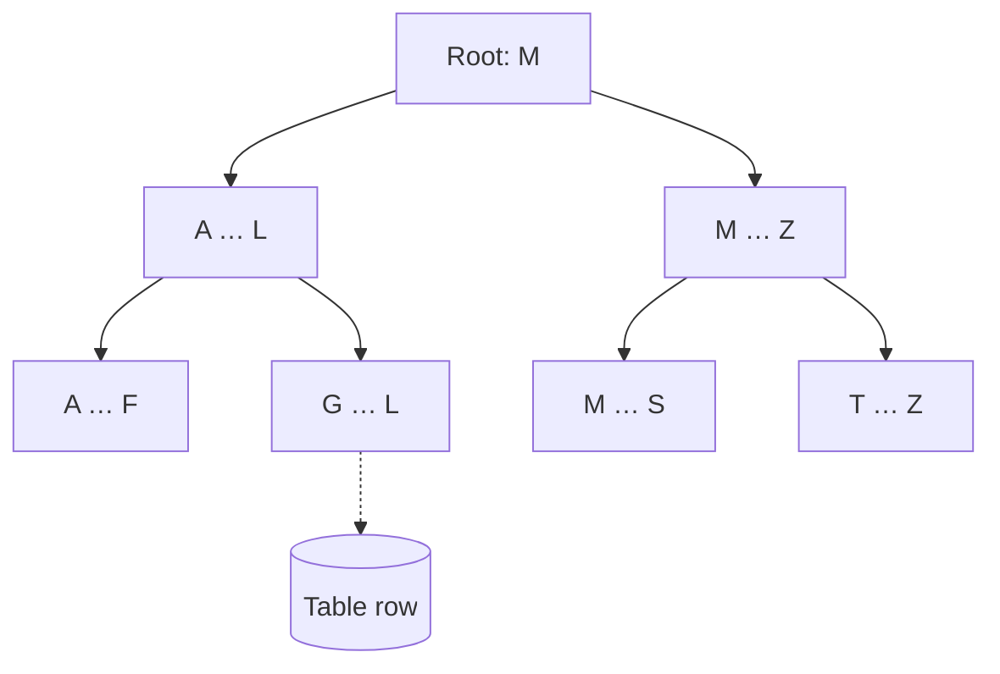

## সমস্যা: হাজার হাজার row

ধরুন আমাদের শপ অনেক বড় হয়ে গেছে — `products` table-এ ১০ লক্ষ প্রোডাক্ট, আর আমরা একটি নির্দিষ্ট SKU খুঁজছি:

```sql
SELECT * FROM products WHERE sku = 'EL-MOU-001';
```

Index না থাকলে Postgres-কে **প্রতিটি row** একটা একটা করে পড়ে দেখতে হয় — একে বলে **Sequential Scan**। অনেকটা বইয়ের সূচিপত্র ছাড়া একটি নির্দিষ্ট লাইন খোঁজার মতো।

## Index কী?

Index হলো একটি আলাদা data structure যা একটি column-এর value গুলো সাজানো অবস্থায় রাখে, সাথে প্রতিটি value কোন row-তে আছে তার ঠিকানা। Postgres-এর default index হলো **B-tree**।



<Reveal each>

- প্রতিটি ধাপে Postgres শুধু একটি শাখা বেছে নেয়, বাকিগুলো বাদ দেয়।
- তাই ১০ লক্ষ row থেকেও মাত্র কয়েকটি ধাপে সঠিক row পাওয়া যায়।
- B-tree `=`, `<`, `>`, `BETWEEN`, `ORDER BY` — সবগুলোতেই কাজে লাগে।

</Reveal>

## EXPLAIN — Postgres কী ভাবছে দেখুন

`EXPLAIN ANALYZE` query টা চালায় এবং Postgres কোন পদ্ধতিতে data খুঁজেছে তা দেখায়।

<Callout type="info" title="নিচের output গুলো উদাহরণ মাত্র">
সময় আর সংখ্যাগুলো আপনার machine আর data-র উপর নির্ভর করবে। দেখার বিষয় হলো **scan-এর ধরন** বদলাচ্ছে কিনা।
</Callout>

### Index-এর আগে

```sql
EXPLAIN ANALYZE
SELECT * FROM products WHERE sku = 'EL-MOU-001';
```

```txt title="Output (উদাহরণ)"
Seq Scan on products  (cost=0.00..21846.00 rows=1 width=64) (actual time=41.207..85.114 rows=1 loops=1)
  Filter: (sku = 'EL-MOU-001'::text)
  Rows Removed by Filter: 999999
Planning Time: 0.102 ms
Execution Time: 85.312 ms
```

`Rows Removed by Filter: 999999` — মাত্র একটি row পেতে প্রায় ১০ লক্ষ row পড়তে হয়েছে।

### Index তৈরি

```sql
CREATE INDEX idx_products_sku ON products (sku);
```

<Callout type="idea" title="UNIQUE নিজেই index বানায়">
আগের lesson-এ `sku TEXT NOT NULL UNIQUE` দিয়েছিলাম — `UNIQUE` আর `PRIMARY KEY` constraint Postgres নিজে থেকেই একটি index তৈরি করে। এখানে বোঝানোর জন্য আলাদা করে দেখানো হলো।
</Callout>

### Index-এর পরে

```txt title="Output (উদাহরণ)"
Index Scan using idx_products_sku on products  (cost=0.42..8.44 rows=1 width=64) (actual time=0.025..0.026 rows=1 loops=1)
  Index Cond: (sku = 'EL-MOU-001'::text)
Planning Time: 0.118 ms
Execution Time: 0.041 ms
```

`Seq Scan` বদলে `Index Scan` হয়েছে — Postgres এখন সরাসরি সঠিক row-তে যাচ্ছে।

## একাধিক column-এর index

```sql
শপে সবচেয়ে কমন কুয়েরি: "একটা ক্যাটাগরির প্রোডাক্ট, দাম অনুযায়ী"।

```sql
CREATE INDEX idx_products_category_price
  ON products (category_id, price);
```

এই index কাজে লাগবে:

```sql
WHERE category_id = 1                    -- ✅
WHERE category_id = 1 AND price < 1000   -- ✅
WHERE price < 1000                       -- ⚠️ সাধারণত কাজে লাগে না
```

<Callout type="warn" title="Column-এর ক্রম গুরুত্বপূর্ণ">
Multi-column B-tree index সবচেয়ে ভালো কাজ করে যখন query-তে **বাম দিকের column** (এখানে `category_id`) থাকে। ফোনবুক যেমন আগে পদবি, তারপর নাম অনুযায়ী সাজানো — শুধু নাম দিয়ে খুঁজলে সুবিধা হয় না।
</Callout>

## Index-এর খরচ

Index সবসময় ভালো নয়।

<Steps reveal>
<Step>
### Write ধীর হয়
প্রতিটি `INSERT`, `UPDATE`, `DELETE`-এ table-এর সাথে সব index-ও update করতে হয়।
</Step>
<Step>
### জায়গা লাগে
প্রতিটি index disk-এ আলাদা জায়গা নেয়।
</Step>
<Step>
### ছোট table-এ অপ্রয়োজনীয়
কয়েকশো row-এর table-এ Postgres প্রায়ই index বাদ দিয়ে sequential scan-ই বেছে নেয়, কারণ সেটাই দ্রুত।
</Step>
</Steps>

## কখন index বানাবেন

| পরিস্থিতি | Index? |
| --- | --- |
| `WHERE`-এ প্রায়ই ব্যবহৃত column | ✅ |
| `JOIN`-এ ব্যবহৃত foreign key | ✅ Postgres নিজে থেকে বানায় না |
| প্রায়ই `ORDER BY` করা column | ✅ |
| খুব কম ভিন্ন value (যেমন `true`/`false`) | ⚠️ সাধারণত লাভ কম |
| খুব ঘন ঘন write হয় এমন table | ⚠️ ভেবেচিন্তে |

<Callout type="success" title="নিয়ম">
আন্দাজে index বানাবেন না। ধীর query খুঁজুন, `EXPLAIN ANALYZE` চালান, তারপর দরকার হলে index যোগ করে আবার মেপে দেখুন।
</Callout>
