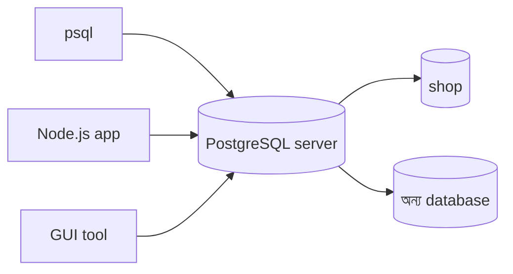

[আগের লেসনে](/docs/postgresql/what-is-postgresql) দেখেছি PostgreSQL কী আর কেন। এবার নিজের কম্পিউটারে এটা চালু করে আমাদের `shop` ডাটাবেস বানাব।

<Callout type="info" title="Server আর client">
**PostgreSQL server** background-এ চলে আর data রাখে। **Client** (যেমন `psql`, বা আপনার Node.js app) server-এ connect করে SQL পাঠায়।
</Callout>



## PostgreSQL চালু করা

নিচের যেকোনো একটি পদ্ধতি বেছে নিন। **Docker সবচেয়ে সহজ**, কারণ সব operating system-এ একই command কাজ করে।

<Tabs items={['Docker', 'macOS', 'Windows']}>
<Tab value="Docker">

```bash title="Terminal"
docker run --name pg-learn \
  -e POSTGRES_PASSWORD=secret \
  -p 5432:5432 \
  -d postgres:17
```

- `--name pg-learn` — container-এর নাম
- `-e POSTGRES_PASSWORD=secret` — default `postgres` user-এর password
- `-p 5432:5432` — Postgres-এর default port আপনার computer-এ খুলে দেয়

</Tab>
<Tab value="macOS">

```bash title="Terminal"
brew install postgresql@17
brew services start postgresql@17
```

Homebrew না থাকলে [Postgres.app](https://postgresapp.com) ব্যবহার করতে পারেন — download করে open করলেই server চালু হয়ে যায়।

</Tab>
<Tab value="Windows">

[postgresql.org/download/windows](https://www.postgresql.org/download/windows/) থেকে installer download করুন। Install করার সময় যে password দেবেন সেটা মনে রাখুন — এটাই `postgres` user-এর password।

</Tab>
</Tabs>

## `psql` দিয়ে connect করা

`psql` হলো PostgreSQL-এর নিজস্ব command-line client।

<Steps reveal>
<Step>
### Connect করুন

```bash title="Terminal"
# Docker ব্যবহার করলে
docker exec -it pg-learn psql -U postgres

# সরাসরি install করলে
psql -U postgres
```
</Step>
<Step>
### আমাদের database তৈরি করুন

```sql
CREATE DATABASE shop;
```
</Step>
<Step>
### নতুন database-এ ঢুকুন

```sql
\c shop
```

Prompt বদলে `shop=#` দেখালে বুঝবেন আপনি সঠিক জায়গায় আছেন।
</Step>
<Step>
### পরীক্ষা করুন

```sql
SELECT version();
```

এটা আপনার PostgreSQL-এর version দেখাবে।
</Step>
</Steps>

## দরকারি `psql` command

`\` দিয়ে শুরু হওয়া command গুলো SQL নয় — এগুলো `psql`-এর নিজস্ব shortcut।

| Command | কাজ |
| --- | --- |
| `\l` | সব database-এর তালিকা |
| `\c name` | অন্য database-এ যাওয়া |
| `\dt` | বর্তমান database-এর সব table |
| `\d table` | একটি table-এর structure |
| `\q` | `psql` থেকে বের হওয়া |

<Callout type="warn" title="Semicolon ভুলবেন না">
SQL statement শেষে `;` না দিলে `psql` ধরে নেয় আপনি এখনো লিখছেন, আর prompt বদলে `shop-#` হয়ে যায়। তখন শুধু `;` লিখে Enter দিন।
</Callout>
