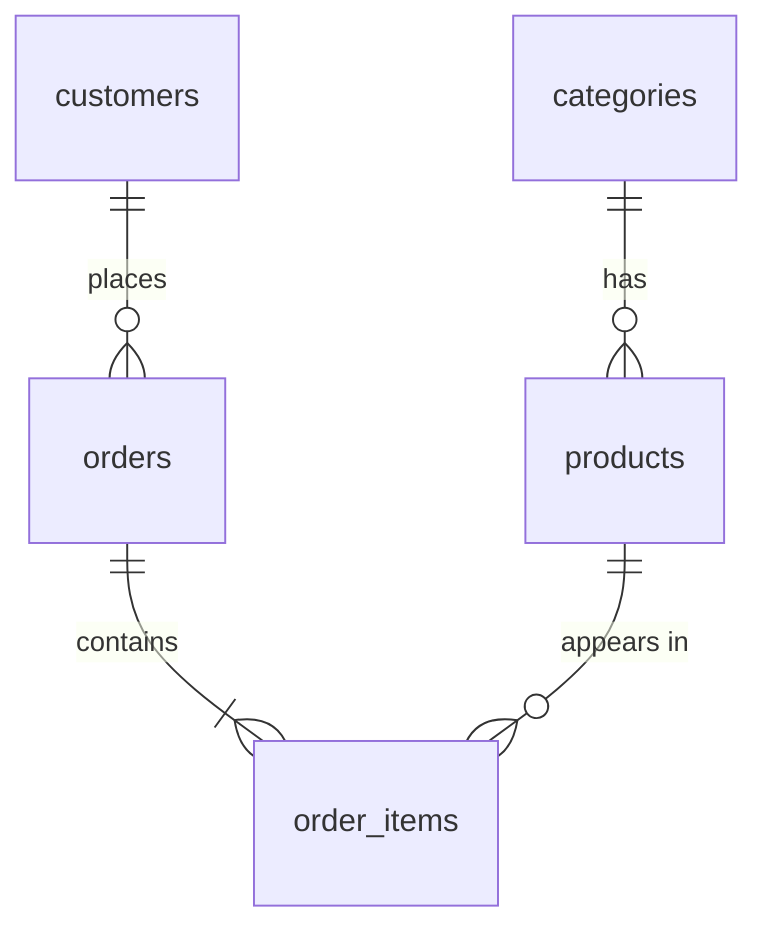
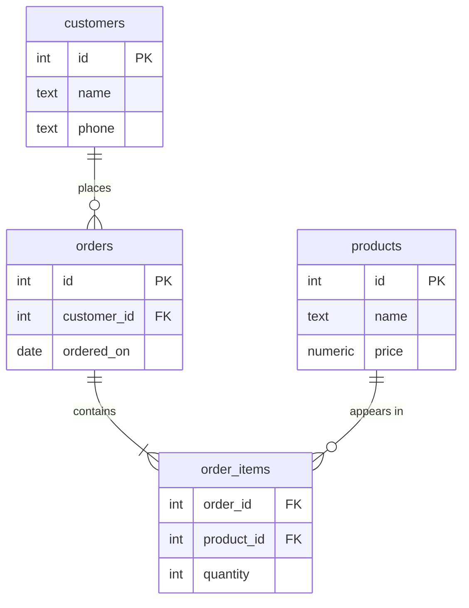

## Types of Databases

সব ডাটাবেস একভাবে ডাটা সাজায় না। ডাটা কীভাবে সাজিয়ে রাখা হয় (একে বলে **data model**), সেই অনুযায়ী ডাটাবেসের অনেক ধরন আছে। সবচেয়ে কমনগুলো:

<Reveal each>

- **Relational** — ডাটা থাকে টেবিলে (row আর column), টেবিলগুলো একে অপরের সাথে সম্পর্কিত। যেমন PostgreSQL, MySQL, SQLite।
- **Document** — প্রতিটা রেকর্ড একটা JSON-এর মতো document। যেমন MongoDB।
- **Key-value** — একটা key দিলে একটা value পাওয়া যায়, অনেকটা ডিকশনারির মতো। যেমন Redis।
- **Graph** — ডাটা থাকে node আর তাদের মধ্যকার সম্পর্ক (edge) আকারে। যেমন Neo4j।
- **Wide-column** — বিশাল পরিমাণ ডাটা অনেকগুলো সার্ভারে ছড়িয়ে রাখার জন্য। যেমন Cassandra।

</Reveal>

একই ডাটা ভিন্ন ভিন্ন model-এ দেখতে কেমন হয়, চলুন আমাদের শপের একটা প্রোডাক্ট দিয়ে দেখি:

<Tabs items={['Relational', 'Document', 'Key-value']}>
<Tab value="Relational">

**`products`**

| id  | name           | category    | price |
| --- | -------------- | ----------- | ----- |
| 1   | Wireless Mouse | Electronics | 850   |

</Tab>
<Tab value="Document">

```json
{
  "_id": 1,
  "name": "Wireless Mouse",
  "category": "Electronics",
  "price": 850,
  "specs": { "dpi": 1600, "battery": "AA" }
}
```

</Tab>
<Tab value="Key-value">

```txt
product:1  →  "Wireless Mouse|Electronics|850"
```

</Tab>
</Tabs>

## Relational vs Non-Relational Databases

রিলেশনাল ছাড়া বাকি সব ধরনকে একসাথে **Non-Relational** বা **NoSQL** ডাটাবেস বলা হয়।

| বিষয় | Relational | Non-Relational (NoSQL) |
| --- | --- | --- |
| ডাটা যেভাবে থাকে | টেবিলে, row আর column আকারে | Document, key-value, graph ইত্যাদি |
| Schema | আগে থেকে ঠিক করা (fixed schema) — প্রতিটা row-এ একই column | সাধারণত ফ্লেক্সিবল — প্রতিটা রেকর্ডে আলাদা ফিল্ড থাকতে পারে |
| সম্পর্ক | Foreign key আর `JOIN` দিয়ে টেবিল যুক্ত করা সহজ | সম্পর্ক রাখা যায়, তবে অনেক ক্ষেত্রে ডাটা এক document-এ ঢুকিয়ে রাখা হয় |
| Query | SQL — স্ট্যান্ডার্ড ভাষা | প্রতিটা ডাটাবেসের নিজস্ব API বা query ভাষা |
| Transaction | শক্তিশালী ACID transaction | ডাটাবেস অনুযায়ী ভিন্ন — অনেকগুলো এখন সাপোর্ট করে, তবে সীমাবদ্ধতা থাকতে পারে |

### কখন কোনটা?

| পরিস্থিতি | সাধারণ পছন্দ |
| --- | --- |
| ডাটার মধ্যে পরিষ্কার সম্পর্ক আছে (customer → order → product) | Relational |
| টাকা-পয়সা, স্টক — নির্ভুলতা সবচেয়ে জরুরি | Relational |
| প্রতিটা রেকর্ডের স্ট্রাকচার আলাদা, ঘনঘন বদলায় | Document |
| খুব দ্রুত cache বা session | Key-value |
| সোশ্যাল নেটওয়ার্কের মতো জটিল সম্পর্ক খোঁজা ("বন্ধুর বন্ধু কারা?") | Graph |

<Callout type="info" title="আমাদের শপের জন্য কোনটা?">
অনলাইন শপের মূল ডাটা — কাস্টমার, প্রোডাক্ট, অর্ডার, পেমেন্ট — একে অপরের সাথে সম্পর্কিত, আর টাকা-পয়সার হিসাব নির্ভুল হতে হবে। তাই রিলেশনাল ডাটাবেস এখানে স্বাভাবিক পছন্দ। বাস্তবে অনেক অ্যাপ্লিকেশন দুটোই ইউজ করে — যেমন মূল ডাটা PostgreSQL-এ, আর cache Redis-এ।
</Callout>

## What is a Relational Database?

**Relational database** হলো এমন ডাটাবেস, যেখানে ডাটা থাকে **টেবিলে**, আর টেবিলগুলো একে অপরের সাথে **সম্পর্ক (relation)** দিয়ে যুক্ত থাকে। এই ধারণাটা আসে ১৯৭০ সালে IBM-এর গবেষক **Edgar F. Codd**-এর **relational model** থেকে।

রিলেশনাল ডাটাবেসের মূল বৈশিষ্ট্য:

<Reveal each>

- **টেবিল** — প্রতিটা বিষয়ের (কাস্টমার, প্রোডাক্ট, অর্ডার) জন্য আলাদা টেবিল।
- **Schema** — প্রতিটা টেবিলে কোন কোন column থাকবে, কোন টাইপের ডাটা থাকবে, তা আগে থেকে ঠিক করা।
- **Key** — প্রতিটা row আলাদাভাবে চেনার উপায় (primary key), আর অন্য টেবিলের সাথে যুক্ত হওয়ার উপায় (foreign key)।
- **SQL** — ডাটা পড়া-লেখার স্ট্যান্ডার্ড ভাষা।

</Reveal>

### সম্পর্কের ধরন

আমাদের শপে টেবিলগুলোর মধ্যে তিন ধরনের সম্পর্ক দেখা যায়:

| সম্পর্ক | মানে | শপের উদাহরণ |
| --- | --- | --- |
| **One-to-one** | একটার সাথে ঠিক একটা | একজন কাস্টমারের একটা প্রোফাইল সেটিং |
| **One-to-many** | একটার সাথে অনেকগুলো | একজন কাস্টমার অনেকগুলো অর্ডার দিতে পারে; একটা ক্যাটাগরিতে অনেকগুলো প্রোডাক্ট |
| **Many-to-many** | অনেকগুলোর সাথে অনেকগুলো | একটা অর্ডারে অনেক প্রোডাক্ট, আবার একটা প্রোডাক্ট অনেক অর্ডারে — মাঝে একটা `order_items` টেবিল লাগে |



## Understanding Tables, Rows and Columns

[প্রথম লেসনের](/docs/postgresql/data-and-database) সেই এক বিশাল Excel শিট ভেঙে আমরা আলাদা টেবিল বানাই — প্রতিটা টেবিল একটা বিষয় নিয়ে।

**`customers`**

| id  | name | phone        |
| --- | ---- | ------------ |
| 1   | রহিম | 01711-000001 |
| 2   | করিম | 01811-000002 |

**`products`**

| id  | name           | price |
| --- | -------------- | ----- |
| 1   | Wireless Mouse | 850   |
| 2   | জামদানি শাড়ি  | 4500  |

**`orders`**

| id  | customer_id | ordered_on |
| --- | ----------- | ---------- |
| 1   | 1           | 2026-09-01 |
| 2   | 2           | 2026-09-02 |
| 3   | 1           | 2026-09-05 |

**`order_items`**

| order_id | product_id | quantity |
| -------- | ---------- | -------- |
| 1        | 1          | 1        |
| 2        | 2          | 1        |
| 3        | 1          | 2        |

<small>(বানানো উদাহরণ। আসল `shop` schema পরের লেসনগুলোতে ধাপে ধাপে বানাব।)</small>

এখন রহিমের নাম-নম্বর মাত্র **একবার** আছে। অর্ডারে শুধু তার `id` (`customer_id = 1`)। রহিমের নম্বর বদলালে শুধু `customers` টেবিলের একটা জায়গায় বদলালেই হবে।

<Reveal each>

- **Table (relation)** — একটা বিষয়ের ডাটা, যেমন `customers`।
- **Row (record / tuple)** — একটা একক জিনিস, যেমন রহিম।
- **Column (field / attribute)** — একটা বৈশিষ্ট্য, যেমন `phone`। প্রতিটা column-এর একটা নির্দিষ্ট **data type** থাকে — `phone` টেক্সট, `price` সংখ্যা।
- **Cell (value)** — একটা row আর একটা column যেখানে মেলে, যেমন রহিমের `phone` = `01711-000001`।
- **Schema** — টেবিলগুলোর স্ট্রাকচার: কোন টেবিলে কোন column, কোন টাইপ, কী নিয়ম।
- **Primary key** — প্রতিটা row-কে আলাদাভাবে চেনার column, যেমন `customers.id`। দুটো row-এর একই primary key হতে পারে না।
- **Foreign key** — অন্য টেবিলের primary key-কে নির্দেশ করে, যেমন `orders.customer_id` → `customers.id`। এভাবেই টেবিলগুলো যুক্ত হয়।

</Reveal>



<Callout type="idea" title="Excel-এর সাথে পার্থক্য কোথায়?">
দেখতে Excel শিটের মতো হলেও, রিলেশনাল টেবিলে প্রতিটা column-এর টাইপ নির্দিষ্ট, নিয়ম (constraint) আছে, আর foreign key ভুল সম্পর্ক তৈরি হতে দেয় না — যেমন অস্তিত্বহীন কাস্টমারের নামে অর্ডার করা সম্ভব না।
</Callout>

## সারসংক্ষেপ

<Steps reveal>
<Step>
### ডাটাবেসের ধরন
Relational, document, key-value, graph, wide-column — ডাটা কীভাবে সাজানো হয় তার উপর নির্ভর করে।
</Step>
<Step>
### Relational vs NoSQL
রিলেশনাল: টেবিল, fixed schema, SQL, শক্তিশালী transaction। NoSQL: ফ্লেক্সিবল স্ট্রাকচার, নিজস্ব query পদ্ধতি।
</Step>
<Step>
### Table, row, column
টেবিল = একটা বিষয়, row = একটা রেকর্ড, column = একটা বৈশিষ্ট্য; primary key আর foreign key দিয়ে টেবিলগুলো যুক্ত।
</Step>
</Steps>
