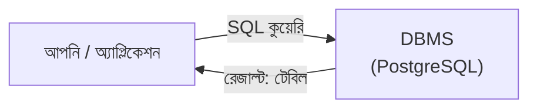

## What is SQL?

**SQL (Structured Query Language)** হলো রিলেশনাল ডাটাবেসের সাথে কথা বলার ভাষা। আমরা অ্যাপ্লিকেশন থেকে বা টার্মিনাল থেকে DBMS-কে SQL লিখে বলি কী চাই — DBMS সেই কাজ করে রেজাল্ট ফেরত দেয়।



SQL-এর জন্ম ১৯৭০-এর দশকে IBM-এ (তখন নাম ছিল SEQUEL)। পরে ১৯৮৬ সালে ANSI আর ১৯৮৭ সালে ISO একে **স্ট্যান্ডার্ড** হিসেবে গ্রহণ করে। এজন্যই PostgreSQL, MySQL, SQL Server — সবগুলোতে মূল SQL প্রায় একই রকম।

### SQL দেখতে কেমন?

SQL পড়তে অনেকটা ইংরেজি বাক্যের মতো:

```sql
-- ১০০০ টাকার নিচের সব প্রোডাক্ট, দাম অনুযায়ী সাজিয়ে
SELECT name, price
FROM products
WHERE price < 1000
ORDER BY price;
```

| name           | price |
| -------------- | ----- |
| পথের পাঁচালী   | 450   |
| Wireless Mouse | 850   |

<small>(আগের লেসনের বানানো ডাটা থেকে।)</small>

### Declarative ভাষা

SQL একটা **declarative** ভাষা — আপনি বলেন **কী** চান, **কীভাবে** আনবে সেটা DBMS নিজে ঠিক করে।

<Reveal each>

- JavaScript-এ হলে আপনাকে লিখতে হতো: প্রতিটা প্রোডাক্টের উপর loop চালাও, দাম চেক করো, লিস্টে রাখো, তারপর sort করো।
- SQL-এ শুধু বলেন: "১০০০ টাকার নিচের প্রোডাক্টগুলো দাও, দাম অনুযায়ী সাজিয়ে।"
- কোন index ইউজ করবে, কোন ক্রমে টেবিল পড়বে — এসব DBMS-এর **query planner** ঠিক করে। **Index** লেসনে এটা নিজের চোখে দেখব।

</Reveal>

### একাধিক টেবিল একসাথে

আগের লেসনে ডাটা আলাদা টেবিলে ভাগ করেছিলাম। SQL দিয়ে সেগুলো আবার জোড়া লাগানো যায় — একে বলে **JOIN**:

```sql
-- রহিম কোন কোন প্রোডাক্ট অর্ডার করেছে?
SELECT products.name, order_items.quantity, orders.ordered_on
FROM orders
JOIN customers   ON customers.id = orders.customer_id
JOIN order_items ON order_items.order_id = orders.id
JOIN products    ON products.id = order_items.product_id
WHERE customers.name = 'রহিম';
```

এখনই এটা বোঝার দরকার নেই — **CRUD query** লেসনে বিস্তারিত দেখব ইনশাআল্লাহ।

### SQL command-এর ভাগ

কাজ অনুযায়ী SQL command-গুলোকে কয়েক ভাগে ভাগ করা হয়:

| ভাগ | পুরো নাম | কাজ | উদাহরণ |
| --- | --- | --- | --- |
| **DDL** | Data Definition Language | স্ট্রাকচার তৈরি/বদল | `CREATE`, `ALTER`, `DROP` |
| **DML** | Data Manipulation Language | ডাটা পড়া/লেখা | `SELECT`, `INSERT`, `UPDATE`, `DELETE` |
| **DCL** | Data Control Language | Permission | `GRANT`, `REVOKE` |
| **TCL** | Transaction Control Language | Transaction | `BEGIN`, `COMMIT`, `ROLLBACK` |

<Callout type="info" title="DBMS-এর কাজের সাথে মিলিয়ে দেখুন">
[DBMS লেসনে](/docs/postgresql/dbms) DBMS-এর যে কাজগুলো দেখেছিলাম — টেবিল ক্রিয়েট (DDL), ডাটা অ্যাড/খোঁজা/আপডেট/ডিলিট (DML), সিকিউর রাখা (DCL) — প্রতিটার জন্যই SQL-এ command আছে।
</Callout>

## SQL vs NoSQL

প্রথমেই একটা কনফিউশন দূর করি: **SQL একটা ভাষা**, কিন্তু **NoSQL কোনো ভাষা না** — এটা ডাটাবেসের একটা ক্যাটাগরি। "SQL vs NoSQL" বলতে আসলে বোঝানো হয় **SQL ডাটাবেস (রিলেশনাল)** বনাম **NoSQL ডাটাবেস (নন-রিলেশনাল)**।

NoSQL নামটা সাধারণত **"Not only SQL"** হিসেবে ব্যাখ্যা করা হয় — মানে শুধু SQL-এর টেবিল দিয়েই না, অন্যভাবেও ডাটা রাখা যায়।

### একই প্রশ্ন, দুই ভাষায়

"রহিমের সব অর্ডার দাও" — রিলেশনাল ডাটাবেসে আর MongoDB-তে:

<Tabs items={['SQL (PostgreSQL)', 'MongoDB']}>
<Tab value="SQL (PostgreSQL)">

```sql
SELECT *
FROM orders
WHERE customer_id = 1;
```

</Tab>
<Tab value="MongoDB">

```js
db.orders.find({ customer_id: 1 });
```

MongoDB-তে ডাটা থাকে **collection**-এ, আর কুয়েরি লেখা হয় JavaScript-এর মতো object দিয়ে।

</Tab>
</Tabs>

### ডাটা রাখার ধরনে পার্থক্য

একটা অর্ডার, তার ভেতরে দুটো প্রোডাক্ট:

<Tabs items={['SQL: আলাদা টেবিল', 'NoSQL: এক document']}>
<Tab value="SQL: আলাদা টেবিল">

**`orders`**

| id  | customer_id | ordered_on |
| --- | ----------- | ---------- |
| 4   | 1           | 2026-09-10 |

**`order_items`**

| order_id | product_id | quantity |
| -------- | ---------- | -------- |
| 4        | 1          | 1        |
| 4        | 4          | 2        |

প্রোডাক্টের নাম-দাম থাকে `products` টেবিলে — দরকার হলে `JOIN` করে আনা হয়।

</Tab>
<Tab value="NoSQL: এক document">

```json
{
  "_id": 4,
  "customer": { "id": 1, "name": "রহিম" },
  "ordered_on": "2026-09-10",
  "items": [
    { "product": "Wireless Mouse", "price": 850, "quantity": 1 },
    { "product": "USB-C Charger", "price": 1200, "quantity": 2 }
  ]
}
```

পুরো অর্ডার একটা document-এ — একবারে পড়া যায়, কিন্তু রহিমের নাম বদলালে তার সব অর্ডার document-এ বদলাতে হতে পারে।

</Tab>
</Tabs>

### পাশাপাশি তুলনা

| বিষয় | SQL ডাটাবেস | NoSQL ডাটাবেস |
| --- | --- | --- |
| ভাষা | স্ট্যান্ডার্ড SQL | প্রতিটা ডাটাবেসের নিজস্ব API/ভাষা |
| Schema | আগে থেকে ঠিক করা | সাধারণত ফ্লেক্সিবল |
| সম্পর্কিত ডাটা | আলাদা টেবিল + `JOIN` | প্রায়ই এক document-এ একসাথে (embed) |
| ডাটার নির্ভুলতা | Constraint আর ACID transaction দিয়ে কঠোরভাবে নিশ্চিত | ডাটাবেস অনুযায়ী ভিন্ন; অনেক দায়িত্ব অ্যাপ্লিকেশনের |
| Scaling | সাধারণত বড় সার্ভার (vertical); read replica, partitioning দিয়েও বাড়ানো যায় | অনেক NoSQL ডাটাবেস শুরু থেকেই অনেক সার্ভারে ছড়ানোর (horizontal) জন্য ডিজাইন করা |
| উদাহরণ | PostgreSQL, MySQL, SQLite, SQL Server | MongoDB, Redis, Cassandra, Neo4j |

<Callout type="warn" title="কোনটা ভালো — এই প্রশ্নটাই ভুল">
দুটোই আলাদা সমস্যার জন্য। সম্পর্কিত ডাটা আর নির্ভুলতা জরুরি হলে SQL; খুব ফ্লেক্সিবল স্ট্রাকচার বা নির্দিষ্ট কাজ (cache, graph) হলে NoSQL। আর সীমারেখাটাও আগের মতো স্পষ্ট না — PostgreSQL-এ `JSONB` দিয়ে document রাখা যায়, আবার MongoDB এখন multi-document transaction সাপোর্ট করে।
</Callout>

## সারসংক্ষেপ

<Steps reveal>
<Step>
### SQL
রিলেশনাল ডাটাবেসের স্ট্যান্ডার্ড, declarative ভাষা — কী চাই বলি, কীভাবে আনবে DBMS ঠিক করে।
</Step>
<Step>
### চার ভাগ
DDL (স্ট্রাকচার), DML (ডাটা), DCL (permission), TCL (transaction)।
</Step>
<Step>
### SQL vs NoSQL
SQL ভাষা, NoSQL ডাটাবেসের ক্যাটাগরি। প্রয়োজন অনুযায়ী বেছে নিতে হয়, অনেক অ্যাপ দুটোই ইউজ করে।
</Step>
</Steps>
