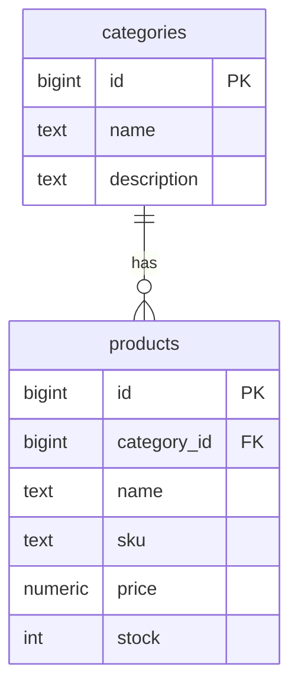
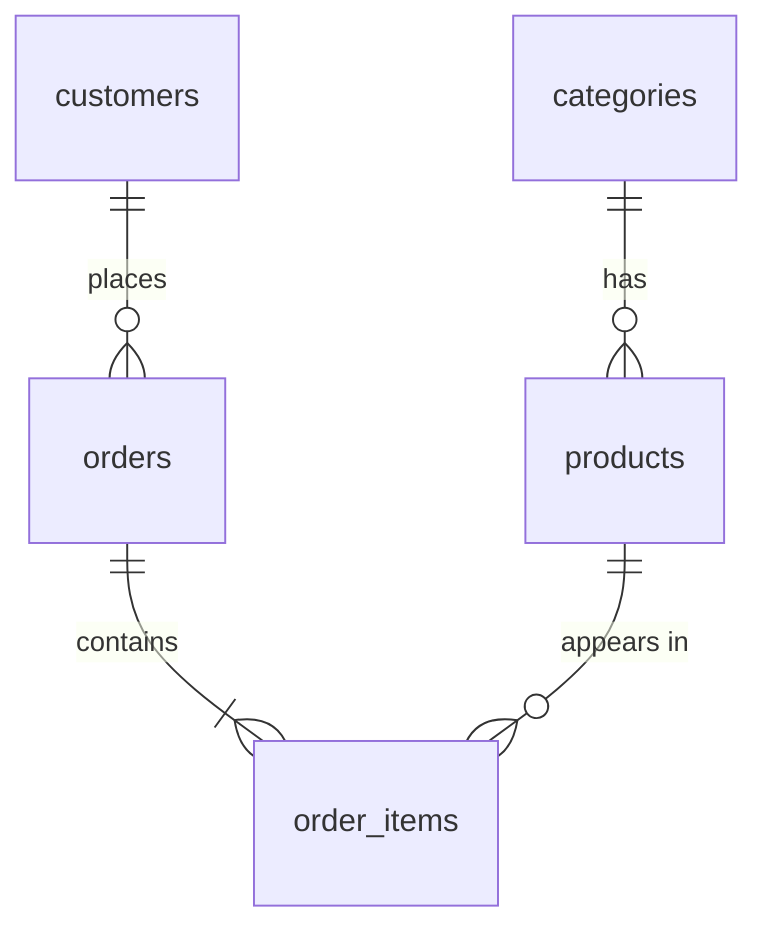

## Table কী?

Table হলো data রাখার মূল জায়গা। প্রতিটি **column**-এর একটি নাম আর একটি **data type** থাকে, আর প্রতিটি **row** হলো একটি record — যেমন একটি প্রোডাক্ট।

| id | name | price | stock |
| --- | --- | --- | --- |
| 1 | Wireless Mouse | 850.00 | 40 |
| 2 | জামদানি শাড়ি | 4500.00 | 6 |

## প্রথম table তৈরি

প্রথমে প্রোডাক্টের ক্যাটাগরি — Electronics, Fashion, Books:

```sql title="categories.sql"
CREATE TABLE categories (
  id          BIGINT GENERATED ALWAYS AS IDENTITY PRIMARY KEY, -- [!code highlight]
  name        TEXT NOT NULL UNIQUE,
  description TEXT,
  created_at  TIMESTAMPTZ NOT NULL DEFAULT now()
);
```

<Reveal each>

- `GENERATED ALWAYS AS IDENTITY` — প্রতিটি নতুন row-তে Postgres নিজে থেকেই `1, 2, 3…` নম্বর বসিয়ে দেয়।
- `PRIMARY KEY` — প্রতিটি row-কে আলাদাভাবে চেনার উপায়। এটা একই সাথে `UNIQUE` আর `NOT NULL`।
- `NOT NULL` — এই column খালি রাখা যাবে না।
- `DEFAULT now()` — value না দিলে বর্তমান সময় বসে যাবে।

</Reveal>

<Callout type="idea" title="SERIAL না IDENTITY?">
পুরোনো tutorial-এ `id SERIAL` দেখবেন। এটা এখনো কাজ করে, কিন্তু PostgreSQL 10 থেকে `IDENTITY` হলো SQL standard পদ্ধতি — নতুন project-এ এটাই ব্যবহার করুন।
</Callout>

## কোন data type কখন?

| প্রয়োজন | Type | মন্তব্য |
| --- | --- | --- |
| নাম, বর্ণনা | `TEXT` | Postgres-এ `TEXT` আর `VARCHAR`-এর performance একই |
| পূর্ণ সংখ্যা | `INTEGER` / `BIGINT` | ID-র জন্য `BIGINT` নিরাপদ |
| টাকা-পয়সা | `NUMERIC(10, 2)` | কখনো `REAL`/`FLOAT` নয় — rounding error হয় |
| হ্যাঁ/না | `BOOLEAN` | `true` / `false` |
| তারিখ | `DATE` | শুধু দিন, সময় নয় |
| সময়সহ তারিখ | `TIMESTAMPTZ` | Time zone সহ রাখে — প্রায় সবসময় এটাই ঠিক |
| অনির্দিষ্ট structure | `JSONB` | Query ও index করা যায় |

<Callout type="warn" title="টাকার হিসাব FLOAT-এ নয়">
`FLOAT` binary-তে সংখ্যা রাখে, তাই `0.1 + 0.2` ঠিক `0.3` হয় না। দাম, balance এর মতো value সবসময় `NUMERIC`-এ রাখুন।
</Callout>

## Constraint দিয়ে data নির্ভুল রাখা

Constraint হলো database-এর নিজস্ব নিয়ম — application-এ bug থাকলেও ভুল data ঢুকতে দেয় না।

```sql title="products.sql"
CREATE TABLE products (
  id          BIGINT GENERATED ALWAYS AS IDENTITY PRIMARY KEY,
  category_id BIGINT NOT NULL REFERENCES categories (id), -- [!code highlight]
  name        TEXT NOT NULL,
  sku         TEXT NOT NULL UNIQUE,                       -- [!code highlight]
  description TEXT,
  price       NUMERIC(10, 2) NOT NULL CHECK (price >= 0), -- [!code highlight]
  stock       INTEGER NOT NULL DEFAULT 0 CHECK (stock >= 0),
  created_at  TIMESTAMPTZ NOT NULL DEFAULT now()
);
```

<Steps reveal>
<Step>
### `REFERENCES` — foreign key
`category_id`-তে শুধু সেই value দেওয়া যাবে যা `categories` table-এ আছে। অস্তিত্বহীন ক্যাটাগরিতে প্রোডাক্ট যোগ করা অসম্ভব।
</Step>
<Step>
### `UNIQUE`
**SKU** (Stock Keeping Unit) হলো প্রতিটা প্রোডাক্টের নিজস্ব কোড, যেমন `EL-MOU-001`। একই SKU দুটো প্রোডাক্টের থাকতে পারবে না।
</Step>
<Step>
### `CHECK`
দাম বা স্টক কখনো negative হতে পারবে না। নিয়ম ভাঙলে Postgres পুরো statement reject করে।
</Step>
</Steps>



## কাস্টমার আর অর্ডারের টেবিল

একটা অর্ডারে একাধিক প্রোডাক্ট থাকতে পারে, আর একটা প্রোডাক্ট অনেক অর্ডারে থাকতে পারে — এই many-to-many সম্পর্কের জন্য মাঝখানে `order_items` টেবিল লাগে ([Relational Database লেসন](/docs/postgresql/relational-databases) মনে করুন)।

```sql title="orders.sql"
CREATE TABLE customers (
  id         BIGINT GENERATED ALWAYS AS IDENTITY PRIMARY KEY,
  name       TEXT NOT NULL,
  email      TEXT NOT NULL UNIQUE,
  phone      TEXT,
  created_at TIMESTAMPTZ NOT NULL DEFAULT now()
);

CREATE TABLE orders (
  id          BIGINT GENERATED ALWAYS AS IDENTITY PRIMARY KEY,
  customer_id BIGINT NOT NULL REFERENCES customers (id),
  status      TEXT NOT NULL DEFAULT 'pending',
  ordered_at  TIMESTAMPTZ NOT NULL DEFAULT now()
);

CREATE TABLE order_items (
  order_id   BIGINT NOT NULL REFERENCES orders (id),
  product_id BIGINT NOT NULL REFERENCES products (id),
  quantity   INTEGER NOT NULL CHECK (quantity > 0),
  unit_price NUMERIC(10, 2) NOT NULL,       -- [!code highlight]
  PRIMARY KEY (order_id, product_id)        -- [!code highlight]
);
```

<Reveal each>

- `unit_price` — অর্ডারের সময় দাম কত ছিল, সেটা আলাদা করে রাখা হয়। পরে প্রোডাক্টের দাম বদলালেও পুরোনো অর্ডারের হিসাব বদলাবে না।
- `PRIMARY KEY (order_id, product_id)` — দুই column মিলে primary key (**composite key**)। একই অর্ডারে একই প্রোডাক্ট দুবার row হিসেবে আসবে না — বেশি লাগলে `quantity` বাড়বে।

</Reveal>



## Table পরিবর্তন করা

Table তৈরির পরেও column যোগ বা পরিবর্তন করা যায়:

```sql
ALTER TABLE products ADD COLUMN is_active BOOLEAN NOT NULL DEFAULT true;
ALTER TABLE categories RENAME COLUMN description TO summary;
```

`psql`-এ `\d products` চালিয়ে দেখুন পরিবর্তন হয়েছে কিনা।
