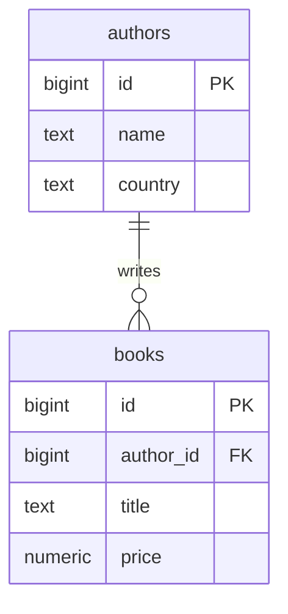

## Table কী?

Table হলো data রাখার মূল জায়গা। প্রতিটি **column**-এর একটি নাম আর একটি **data type** থাকে, আর প্রতিটি **row** হলো একটি record — যেমন একটি বই।

| id | title | price | published_on |
| --- | --- | --- | --- |
| 1 | পথের পাঁচালী | 350.00 | 1929-01-01 |
| 2 | Clean Code | 1200.00 | 2008-08-01 |

## প্রথম table তৈরি

```sql title="authors.sql"
CREATE TABLE authors (
  id         BIGINT GENERATED ALWAYS AS IDENTITY PRIMARY KEY, -- [!code highlight]
  name       TEXT NOT NULL,
  country    TEXT,
  created_at TIMESTAMPTZ NOT NULL DEFAULT now()
);
```

<Reveal each>

- `GENERATED ALWAYS AS IDENTITY` — প্রতিটি নতুন row-তে Postgres নিজে থেকেই `1, 2, 3…` নম্বর বসিয়ে দেয়।
- `PRIMARY KEY` — প্রতিটি row-কে আলাদাভাবে চেনার উপায়। এটা একই সাথে `UNIQUE` আর `NOT NULL`।
- `NOT NULL` — এই column খালি রাখা যাবে না।
- `DEFAULT now()` — value না দিলে বর্তমান সময় বসে যাবে।

</Reveal>

<Callout type="idea" title="SERIAL না IDENTITY?">
পুরোনো tutorial-এ `id SERIAL` দেখবেন। এটা এখনো কাজ করে, কিন্তু PostgreSQL 10 থেকে `IDENTITY` হলো SQL standard পদ্ধতি — নতুন project-এ এটাই ব্যবহার করুন।
</Callout>

## কোন data type কখন?

| প্রয়োজন | Type | মন্তব্য |
| --- | --- | --- |
| নাম, বর্ণনা | `TEXT` | Postgres-এ `TEXT` আর `VARCHAR`-এর performance একই |
| পূর্ণ সংখ্যা | `INTEGER` / `BIGINT` | ID-র জন্য `BIGINT` নিরাপদ |
| টাকা-পয়সা | `NUMERIC(10, 2)` | কখনো `REAL`/`FLOAT` নয় — rounding error হয় |
| হ্যাঁ/না | `BOOLEAN` | `true` / `false` |
| তারিখ | `DATE` | শুধু দিন, সময় নয় |
| সময়সহ তারিখ | `TIMESTAMPTZ` | Time zone সহ রাখে — প্রায় সবসময় এটাই ঠিক |
| অনির্দিষ্ট structure | `JSONB` | Query ও index করা যায় |

<Callout type="warn" title="টাকার হিসাব FLOAT-এ নয়">
`FLOAT` binary-তে সংখ্যা রাখে, তাই `0.1 + 0.2` ঠিক `0.3` হয় না। দাম, balance এর মতো value সবসময় `NUMERIC`-এ রাখুন।
</Callout>

## Constraint দিয়ে data নির্ভুল রাখা

Constraint হলো database-এর নিজস্ব নিয়ম — application-এ bug থাকলেও ভুল data ঢুকতে দেয় না।

```sql title="books.sql"
CREATE TABLE books (
  id           BIGINT GENERATED ALWAYS AS IDENTITY PRIMARY KEY,
  author_id    BIGINT NOT NULL REFERENCES authors (id), -- [!code highlight]
  title        TEXT NOT NULL,
  isbn         TEXT UNIQUE,                             -- [!code highlight]
  price        NUMERIC(10, 2) NOT NULL CHECK (price >= 0), -- [!code highlight]
  stock        INTEGER NOT NULL DEFAULT 0,
  published_on DATE
);
```

<Steps reveal>
<Step>
### `REFERENCES` — foreign key
`author_id`-তে শুধু সেই value দেওয়া যাবে যা `authors` table-এ আছে। অস্তিত্বহীন লেখকের বই যোগ করা অসম্ভব।
</Step>
<Step>
### `UNIQUE`
একই ISBN দুটি বইয়ের থাকতে পারবে না।
</Step>
<Step>
### `CHECK`
দাম কখনো negative হতে পারবে না। নিয়ম ভাঙলে Postgres পুরো statement reject করে।
</Step>
</Steps>



## Table পরিবর্তন করা

Table তৈরির পরেও column যোগ বা পরিবর্তন করা যায়:

```sql
ALTER TABLE books ADD COLUMN language TEXT NOT NULL DEFAULT 'bn';
ALTER TABLE books RENAME COLUMN stock TO stock_count;
```

`psql`-এ `\d books` চালিয়ে দেখুন পরিবর্তন হয়েছে কিনা।
