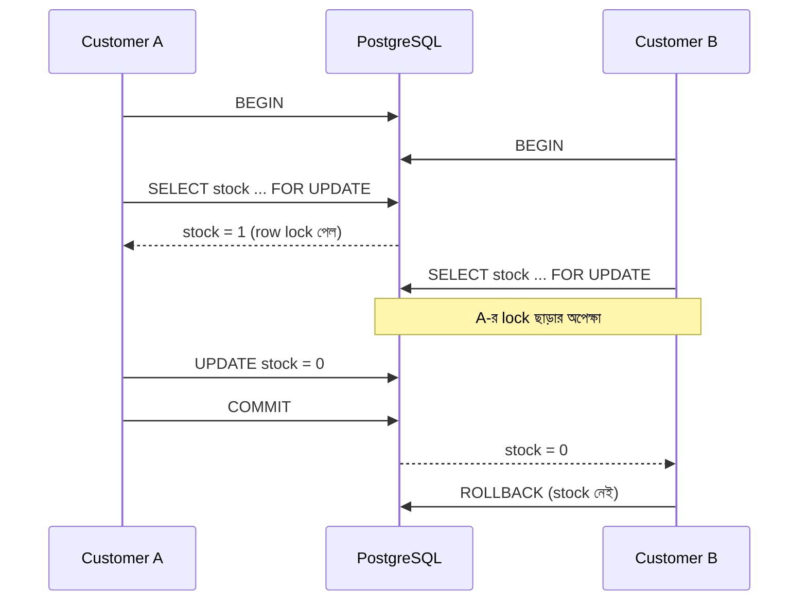

## সমস্যা: অর্ধেক হয়ে থাকা কাজ

একজন customer একটি বই কিনছেন। Database-এ দুটি কাজ করতে হবে (উদাহরণ সহজ রাখতে এখানে `orders` table-এ সরাসরি `book_id` রাখা হয়েছে):

```sql
INSERT INTO orders (customer_id, book_id, quantity) VALUES (7, 3, 1);
UPDATE books SET stock_count = stock_count - 1 WHERE id = 3;
```

প্রথম statement সফল হলো, কিন্তু দ্বিতীয়টি চলার আগেই server বন্ধ হয়ে গেল। এখন order আছে কিন্তু stock কমেনি — data **অসামঞ্জস্যপূর্ণ**।

## সমাধান: Transaction

Transaction একাধিক statement-কে একটি ইউনিটে বাঁধে — **হয় সবগুলো হবে, না হয় একটিও না।**

```sql title="order.sql"
BEGIN; -- [!code highlight]

INSERT INTO orders (customer_id, book_id, quantity) VALUES (7, 3, 1);
UPDATE books SET stock_count = stock_count - 1 WHERE id = 3;

COMMIT; -- [!code highlight]
```

<Steps reveal>
<Step>
### `BEGIN`
Transaction শুরু। এরপরের পরিবর্তনগুলো অন্য connection এখনো দেখতে পায় না।
</Step>
<Step>
### কাজগুলো চালানো
যতগুলো statement দরকার।
</Step>
<Step>
### `COMMIT` বা `ROLLBACK`
`COMMIT` সব পরিবর্তন স্থায়ী করে। `ROLLBACK` সব বাতিল করে `BEGIN`-এর আগের অবস্থায় ফিরিয়ে নেয়।
</Step>
</Steps>

মাঝপথে কোনো statement error দিলে Postgres পুরো transaction-কে ব্যর্থ হিসেবে চিহ্নিত করে — তখন `ROLLBACK` ছাড়া আর কিছু করা যায় না।

```sql
BEGIN;
UPDATE books SET price = -50 WHERE id = 3;
-- ERROR: CHECK constraint ভাঙা হয়েছে
ROLLBACK; -- কোনো পরিবর্তন হয়নি
```

## ACID

ভালো transaction-এর চারটি বৈশিষ্ট্য:

<Reveal each>

- **A — Atomicity:** সব হবে, নয়তো কিছুই না।
- **C — Consistency:** প্রতিটি transaction শেষে সব constraint (foreign key, `CHECK`, `UNIQUE`) মানা থাকবে।
- **I — Isolation:** একসাথে চলা transaction একে অপরের অসম্পূর্ণ কাজ দেখবে না।
- **D — Durability:** `COMMIT` সফল হওয়ার পর server crash করলেও data হারাবে না।

</Reveal>

## একসাথে দুই customer

শেষ কপিটি একই সময়ে দুজন কিনতে চাইছেন। সাবধান না থাকলে দুজনই "stock আছে" দেখবেন।



```sql title="safe-purchase.sql"
BEGIN;

SELECT stock_count FROM books WHERE id = 3 FOR UPDATE; -- [!code highlight]
-- stock_count > 0 হলে:
UPDATE books SET stock_count = stock_count - 1 WHERE id = 3;
INSERT INTO orders (customer_id, book_id, quantity) VALUES (7, 3, 1);

COMMIT;
```

`FOR UPDATE` row টিকে lock করে, ফলে অন্য transaction সেই row পরিবর্তন বা lock করতে চাইলে অপেক্ষা করতে বাধ্য হয়।

<Callout type="idea" title="আরো সহজ উপায়">
অনেক ক্ষেত্রে একটি statement-ই যথেষ্ট:

```sql
UPDATE books SET stock_count = stock_count - 1
WHERE id = 3 AND stock_count > 0
RETURNING stock_count;
```

কোনো row ফেরত না এলে বুঝবেন stock শেষ।
</Callout>

## Isolation level

Isolation কতটা কঠোর হবে তা বেছে নেওয়া যায়:

| Level | কী নিশ্চিত করে | মন্তব্য |
| --- | --- | --- |
| `READ COMMITTED` | শুধু commit হওয়া data দেখা যায় | **Postgres-এর default** |
| `REPEATABLE READ` | Transaction জুড়ে একই data দেখা যায় | Report তৈরিতে উপযোগী |
| `SERIALIZABLE` | যেন transaction গুলো একটার পর একটা চলেছে | সবচেয়ে নিরাপদ; conflict হলে retry করতে হয় |

```sql
BEGIN ISOLATION LEVEL SERIALIZABLE;
-- ...
COMMIT;
```

<Callout type="info" title="Postgres-এ READ UNCOMMITTED নেই">
SQL standard-এ `READ UNCOMMITTED` level আছে, কিন্তু Postgres-এ এটি `READ COMMITTED`-এর মতোই আচরণ করে — অন্য transaction-এর commit না হওয়া data Postgres কখনো দেখায় না।
</Callout>
