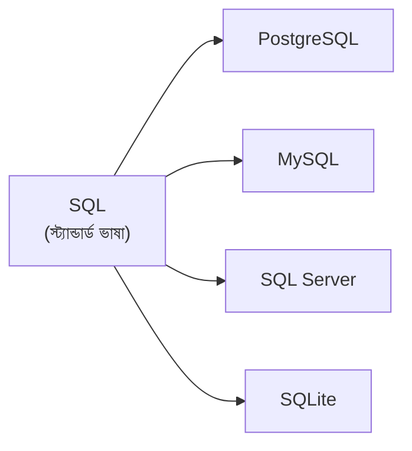
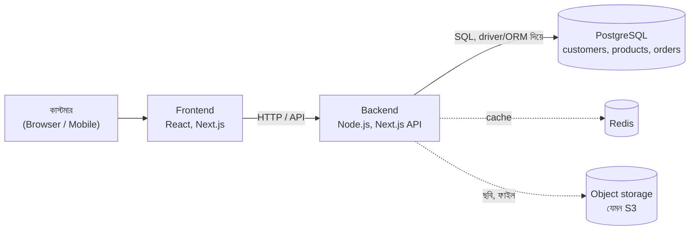

## What is PostgreSQL?

**PostgreSQL** (সংক্ষেপে **Postgres**, উচ্চারণ "পোস্ট-গ্রেস-কিউ-এল") হলো একটা ফ্রি আর ওপেন সোর্স **relational DBMS**। মানে [আগের লেসনগুলোতে](/docs/postgresql/relational-databases) দেখা টেবিল, row, column আর key-ভিত্তিক ডাটাবেস ম্যানেজ করার সফটওয়্যার।

অফিশিয়াল ওয়েবসাইট নিজেকে বলে **object-relational** database system — মানে রিলেশনাল ডাটাবেসের সব সুবিধার সাথে নিজের ডাটা টাইপ, ফাংশন, এক্সটেনশন বানানোর সুযোগও দেয়।

### ছোট্ট ইতিহাস

<Steps reveal>
<Step>
### ১৯৮৬ — POSTGRES
University of California, Berkeley-তে Professor Michael Stonebraker-এর নেতৃত্বে POSTGRES প্রজেক্টের কাজ শুরু।
</Step>
<Step>
### ১৯৯৪ — Postgres95
Andrew Yu আর Jolly Chen এতে SQL ভাষা যোগ করেন।
</Step>
<Step>
### ১৯৯৬ — PostgreSQL
নাম বদলে হয় PostgreSQL — নামের মধ্যেই আছে "SQL"। তখন থেকে সারা বিশ্বের ভলান্টিয়ার আর কোম্পানির একটা কমিউনিটি (PostgreSQL Global Development Group) এটা ডেভেলপ করছে।
</Step>
</Steps>

<small>সূত্র: [PostgreSQL docs — A Brief History of PostgreSQL](https://www.postgresql.org/docs/current/history.html)</small>

## PostgreSQL vs SQL

নতুনদের সবচেয়ে কমন কনফিউশন: "SQL শিখব নাকি PostgreSQL?" আসলে দুটো দুই জিনিস।

| | SQL | PostgreSQL |
| --- | --- | --- |
| কী জিনিস | **ভাষা** | **সফটওয়্যার** (DBMS) |
| কাজ | ডাটাবেসকে কী করতে হবে তা বলা | SQL বুঝে সেই কাজ করা, ডাটা স্টোর করা |
| ইনস্টল করা যায়? | না — এটা একটা স্ট্যান্ডার্ড | হ্যাঁ |
| উপমা | ইংরেজি ভাষা | যে মানুষটা ইংরেজি বোঝে আর কাজ করে দেয় |

সব রিলেশনাল DBMS SQL বোঝে, তবে প্রত্যেকের কিছু নিজস্ব এক্সটেনশন বা "উপভাষা" (**dialect**) আছে। যেমন PostgreSQL-এর `RETURNING`, `JSONB`, `ILIKE` — এগুলো স্ট্যান্ডার্ড SQL-এর বাইরে Postgres-এর নিজস্ব সুবিধা।

<Callout type="success" title="ভালো খবর">
এই সিরিজে PostgreSQL শেখার মানে আসলে SQL-ও শেখা। PostgreSQL স্ট্যান্ডার্ড SQL খুব কাছ থেকে মেনে চলে — অফিশিয়াল তথ্য অনুযায়ী, ২০২৫ সালের সেপ্টেম্বরে বের হওয়া version 18, SQL:2023 Core-এর ১৭৭টা mandatory feature-এর মধ্যে অন্তত ১৭০টা মেনে চলে। তাই এখানে যা শিখবেন, তার বেশিরভাগই MySQL বা অন্য ডাটাবেসেও কাজে লাগবে।
</Callout>

<small>সূত্র: [postgresql.org/about](https://www.postgresql.org/about/)</small>

## Why PostgreSQL?

<Reveal each>

- **নির্ভরযোগ্য** — ACID transaction পুরোপুরি সাপোর্ট করে, আর Write-Ahead Log (WAL) দিয়ে ক্র্যাশের পরেও ডাটা রিকভার করে। শপের টাকা-পয়সার হিসাবে ভুল হওয়ার ঝুঁকি কম।
- **স্ট্যান্ডার্ড SQL** — উপরে যেমন দেখলাম, যা শিখবেন তা অন্য জায়গাতেও কাজে লাগবে।
- **অনেক ধরনের ডাটা** — সাধারণ text, number ছাড়াও `JSONB`, array, date/time, UUID, range, এমনকি জ্যামিতিক ডাটা। প্রোডাক্টের আলাদা আলাদা স্পেসিফিকেশন (মাউসের DPI, শাড়ির কাপড়) `JSONB`-তে রাখা যায়।
- **ডাটা নির্ভুল রাখার নিয়ম** — `PRIMARY KEY`, `FOREIGN KEY`, `UNIQUE`, `NOT NULL`, `CHECK` — ভুল ডাটা ঢোকার আগেই আটকায়।
- **একসাথে অনেক ইউজার** — **MVCC** (Multi-Version Concurrency Control) পদ্ধতিতে কেউ ডাটা পড়ার সময় আরেকজন লিখলেও কেউ কাউকে আটকায় না।
- **এক্সটেনশন** — **PostGIS** দিয়ে ম্যাপ/লোকেশন ডাটা, **pgvector** দিয়ে AI embedding search পর্যন্ত করা যায়। বিল্ট-ইন full-text search-ও আছে।
- **সম্পূর্ণ ফ্রি** — "PostgreSQL License" নামে একটা উদার ওপেন সোর্স লাইসেন্সে রিলিজ করা, কমার্শিয়াল কাজেও কোনো লাইসেন্স ফি নেই।

</Reveal>

<small>সূত্র: [postgresql.org/about](https://www.postgresql.org/about/), [PostgreSQL License](https://www.postgresql.org/about/licence/)</small>

## PostgreSQL vs MySQL vs MongoDB

তিনটাই খুব জনপ্রিয়, কিন্তু উদ্দেশ্য আর ডিজাইনে পার্থক্য আছে:

| বিষয় | PostgreSQL | MySQL | MongoDB |
| --- | --- | --- | --- |
| ধরন | Relational (object-relational) | Relational | Document (NoSQL) |
| ডাটা যেভাবে থাকে | টেবিল | টেবিল | JSON-এর মতো document (BSON), collection-এ |
| কুয়েরি ভাষা | SQL | SQL | MongoDB Query API |
| Schema | Fixed, তবে `JSONB` দিয়ে ফ্লেক্সিবল অংশ রাখা যায় | Fixed, `JSON` টাইপ আছে | ফ্লেক্সিবল (চাইলে validation যোগ করা যায়) |
| Transaction | ACID | ACID (default InnoDB engine-এ) | ACID — multi-document transaction version 4.0 থেকে |
| এক্সটেনশন | খুব শক্তিশালী (PostGIS, pgvector ইত্যাদি) | সীমিত | — |
| লাইসেন্স | PostgreSQL License (উদার ওপেন সোর্স) | GPL (Community) + Oracle-এর কমার্শিয়াল লাইসেন্স | SSPL (Community) + কমার্শিয়াল |
| ভালো যেখানে | জটিল কুয়েরি, ডাটার নির্ভুলতা, নানা ধরনের ডাটা একসাথে | সহজ ওয়েব অ্যাপ, read-heavy কাজ, WordPress-এর মতো CMS | দ্রুত বদলায় এমন স্ট্রাকচার, document-ভিত্তিক ডাটা |

<small>সূত্র: প্রতিটার অফিশিয়াল ডকুমেন্টেশন ও লাইসেন্স পেজ — [PostgreSQL](https://www.postgresql.org/about/), [MySQL](https://www.mysql.com/products/community/), [MongoDB](https://www.mongodb.com/legal/licensing/server-side-public-license)। "ভালো যেখানে" সারিটা সাধারণ প্রচলিত ধারণা, কোনো বেঞ্চমার্ক না।</small>

<Callout type="info" title="তাহলে আমাদের শপে PostgreSQL কেন?">
অর্ডার, পেমেন্ট, স্টক — এগুলো নির্ভুল হতেই হবে (ACID)। কাস্টমার → অর্ডার → প্রোডাক্ট — সম্পর্কগুলো পরিষ্কার (relational)। আবার প্রতিটা ক্যাটাগরির প্রোডাক্টের স্পেসিফিকেশন আলাদা (`JSONB`)। PostgreSQL একাই তিনটা সামলাতে পারে।
</Callout>

## Where PostgreSQL Fits in a Modern Application

একটা মডার্ন অনলাইন শপে PostgreSQL থাকে একদম পেছনে — কাস্টমার কখনো সরাসরি এর সাথে কথা বলে না।

একটা অর্ডার দেওয়ার সময় কী হয়:

<Steps reveal>
<Step>
### কাস্টমার "Order" বাটনে ক্লিক করে
Frontend ব্যাকএন্ডের API-তে রিকোয়েস্ট পাঠায়।
</Step>
<Step>
### Backend যাচাই করে
কাস্টমার লগইন করা কিনা, কার্টে কী আছে।
</Step>
<Step>
### Backend PostgreSQL-কে SQL পাঠায়
সাধারণত সরাসরি SQL না লিখে একটা **driver** (যেমন `pg`) বা **ORM** (যেমন Prisma, Drizzle) ইউজ করে, যেটা ভেতরে SQL-ই পাঠায়। একটা **transaction**-এর মধ্যে অর্ডার তৈরি হয় আর স্টক কমে।
</Step>
<Step>
### PostgreSQL ডাটা সেভ করে রেজাল্ট দেয়
Backend সেই রেজাল্ট দিয়ে কাস্টমারকে "অর্ডার সফল হয়েছে" দেখায়।
</Step>
</Steps>

<Reveal each>

- **PostgreSQL কাজ করে:** মূল ডাটা — কাস্টমার, প্রোডাক্ট, অর্ডার, পেমেন্ট — নির্ভুল আর স্থায়ীভাবে রাখা।
- **PostgreSQL সাধারণত করে না:** ছবি-ভিডিওর মতো বড় ফাইল রাখা (সেগুলো object storage-এ থাকে, ডাটাবেসে শুধু লিংক), বা প্রতি সেকেন্ডে হাজারবার পড়া হয় এমন ডাটার cache (সেটা Redis-এর মতো ডাটাবেসে)।
- **কোথায় চলে:** নিজের সার্ভারে, Docker-এ, অথবা **managed service**-এ — যেমন AWS RDS, Google Cloud SQL, Supabase, Neon — যেখানে backup, আপডেট সার্ভিসটাই সামলায়।

</Reveal>

## সারসংক্ষেপ

<Steps reveal>
<Step>
### PostgreSQL
১৯৮৬ সাল থেকে চলে আসা ফ্রি, ওপেন সোর্স, object-relational DBMS।
</Step>
<Step>
### SQL ≠ PostgreSQL
SQL ভাষা, PostgreSQL সেই ভাষা বোঝা সফটওয়্যার।
</Step>
<Step>
### কেন PostgreSQL
নির্ভরযোগ্য, স্ট্যান্ডার্ড SQL, নানা ধরনের ডাটা, শক্তিশালী এক্সটেনশন, সম্পূর্ণ ফ্রি।
</Step>
<Step>
### পরের লেসন
এবার PostgreSQL নিজের কম্পিউটারে ইনস্টল করে আমাদের `shop` ডাটাবেস বানাব।
</Step>
</Steps>
