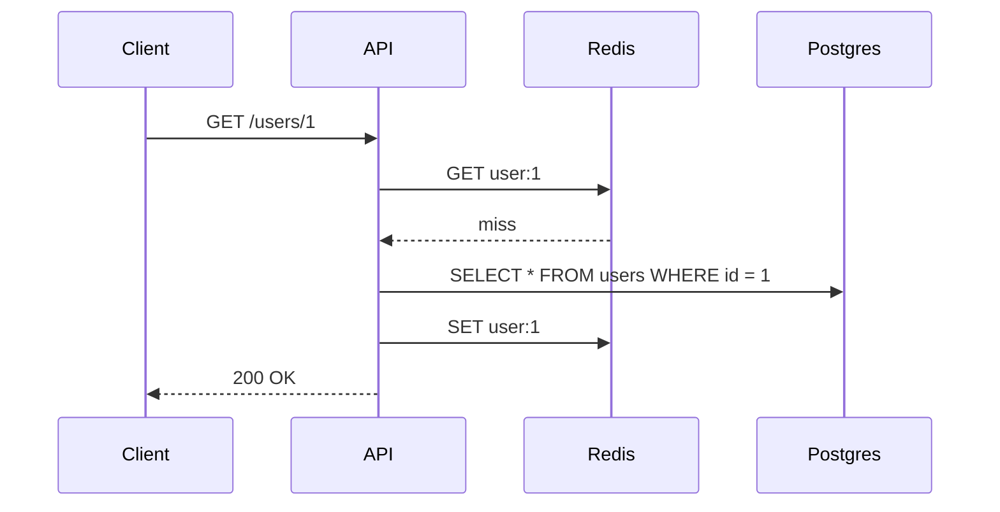

## Mixed Bangla + English

ডেটাবেস ইনডেক্স (index) হলো একটি data structure যা query কে দ্রুত করে। যেমন `B-tree` index।

## Code Block

```sql title="create-index.sql"
-- ইনডেক্স তৈরি করা
CREATE TABLE users (id SERIAL PRIMARY KEY, email TEXT); -- [!code highlight]
CREATE INDEX idx_users_email ON users (email); -- [!code ++]
SELECT * FROM users WHERE email = 'a@b.com';
```

## Diagram



## Steps

<Steps>
<Step>
### ইনস্টল করুন
`pnpm add ioredis`
</Step>
<Step>
### Connect
Create a client and call `redis.get()`.
</Step>
</Steps>
